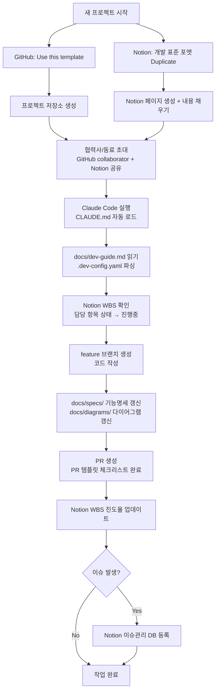

# 개발 표준 포맷 — AI Agent + GitHub + Notion 바이브코딩 프레임워크

> 이 저장소는 **AI Agent + GitHub + Notion** 기반 바이브코딩 표준 프레임워크의 템플릿입니다.
> 모든 협력사 및 개발 인원이 동일한 구조로 개발을 진행할 수 있도록 재현성과 반복성을 보장합니다.

---

## 워크플로우 구조도



---

## 저장소 파일 구조 및 역할

```
(repo root)
├── CLAUDE.md                          ← Claude Code 세션 자동 로드 (에이전트 진입점)
├── .dev-config.yaml                   ← 코딩 표준 설정 (Config ①~⑤, 에이전트 파싱용)
├── README.md                          ← 지금 읽고 있는 파일
└── docs/
    ├── dev-guide.md                   ← 통합 개발 가이드 (에이전트 필수 참조, Notion URL 포함)
    ├── WORKFLOW.md                    ← 관리자/협력사 전체 워크플로우 정의
    ├── ONBOARDING.md                  ← 협력사/동료 환경설정 및 시작 절차
    ├── diagrams/                      ← 코드 구조 다이어그램 (mermaid, TD 방향)
    └── specs/                         ← 파일별 기능명세 md
```

| 파일 | 주요 독자 | 핵심 내용 |
|---|---|---|
| `CLAUDE.md` | 에이전트 (자동 로드) | 읽기 순서 지시, 작업 체크리스트 |
| `docs/dev-guide.md` | 에이전트 + 사람 | 프로젝트 개요, 기술스택, 코드 규칙, Notion URL |
| `.dev-config.yaml` | 에이전트 (파싱) | 코딩 표준 설정값, 자동화 트리거 |
| `docs/WORKFLOW.md` | 관리자 + 협력사 | 전체 워크플로우, 환경설정 체크리스트 |
| `docs/ONBOARDING.md` | 협력사/동료 | 환경설정 방법, 시작 절차, FAQ |
| `.github/PULL_REQUEST_TEMPLATE.md` | PR 작성자 | PR 체크리스트 |

---

## Notion 페이지 구조

```
개발 표준 포맷 (최상위 페이지)
├── 설계
│   ├── RFP
│   │   ├── 원본 데이터
│   │   └── 가공 데이터
│   ├── WBS (DB)
│   └── 개발지침서
│       ├── Config
│       └── 개발 가이드
└── 개발
    ├── 진척현황
    │   ├── [WBS DB Linked View]
    │   └── 주차별 진척관리 (DB)
    └── 이슈관리 (DB)
```

---

## 빠른 시작

### 관리자 (프로젝트 소유자)
1. 이 저장소 → **"Use this template"** 으로 새 저장소 생성
2. Notion `개발 표준 포맷` 페이지 → **Duplicate** → 프로젝트명으로 변경
3. `docs/dev-guide.md` 실제 프로젝트 내용으로 업데이트
4. Notion WBS에 개발 항목 입력 + 담당자 배정
5. 협력사/동료 초대 후 `docs/ONBOARDING.md` 공유

> 상세 절차 → [docs/WORKFLOW.md](docs/WORKFLOW.md)

### 협력사 / 동료
1. 관리자에게 GitHub URL + Notion URL + 담당 WBS 항목 받기
2. 저장소 clone 후 Claude Code 실행 (CLAUDE.md 자동 로드)
3. `"docs/dev-guide.md 읽고 WBS [항목명] 확인 후 작업 시작해줘"` 한 줄이면 시작

> 상세 환경 설정 → [docs/ONBOARDING.md](docs/ONBOARDING.md)

---

## 개발 시작 전 체크리스트

- [ ] `docs/dev-guide.md` 읽기 완료
- [ ] `.dev-config.yaml` 설정값 파악 완료
- [ ] Notion WBS에서 현재 작업 항목 확인
- [ ] 브랜치 네이밍 규칙 준수: `feature/{feature-name}` / `hotfix/{issue-name}`
- [ ] 파일 헤더 주석 작성 (Config ③ 기준)
- [ ] commit/push 후 `docs/diagrams/`, `docs/specs/` 갱신
- [ ] Notion WBS 진도율 업데이트

---

## 기술 스택 (기본값 — 프로젝트별 수정)

| 구성 요소 | 기술 |
|---|---|
| AI Agent | Claude (Sonnet) |
| VCS | GitHub |
| 문서/지식관리 | Notion |
| 다이어그램 | Mermaid |

---

*이 저장소는 프로젝트에 독립적인 범용 템플릿입니다. 신규 프로젝트 시작 시 "Use this template"으로 복제하여 사용하세요.*
