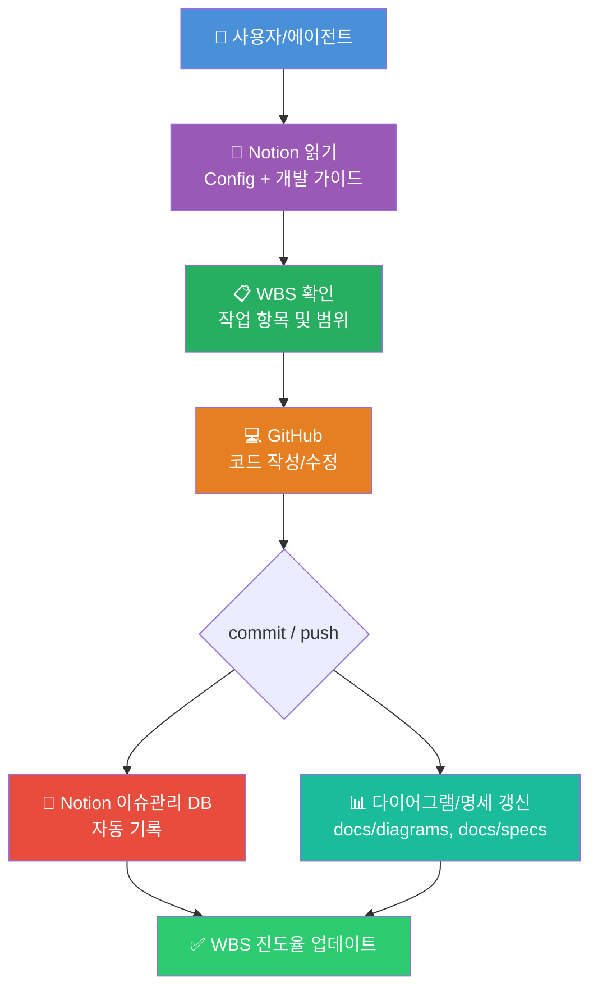

# 개발 표준 포맷 — AI Agent + GitHub + Notion 바이브코딩 프레임워크

> 이 저장소는 **AI Agent + GitHub + Notion** 기반 바이브코딩 표준 프레임워크의 템플릿입니다.
> 모든 협력사 및 개발 인원이 동일한 구조로 개발을 진행할 수 있도록 재현성과 반복성을 보장합니다.

---

## 워크플로우 구조도



---

## Notion 페이지 구조

```
개발 표준 포맷 (최상위 페이지)
├── 설계
│   ├── RFP
│   │   ├── 원본 데이터
│   │   └── 가공 데이터
│   ├── WBS (DB)
│   └── 개발지침서
│       ├── Config
│       └── 개발 가이드
└── 개발
    ├── 진척현황
    │   ├── [WBS DB Linked View]
    │   └── 주차별 진척관리 (DB)
    └── 이슈관리 (DB)
```

---

## 디렉토리 구조

```
(repo root)
├── .github/
│   └── PULL_REQUEST_TEMPLATE.md   # PR 템플릿
├── docs/
│   ├── diagrams/                  # 코드 구조 다이어그램 (Mermaid)
│   ├── specs/                     # 파일별 기능명세 (*.md)
│   └── dev-guide.md               # 개발 가이드 (Notion 동기화)
├── .dev-config.yaml               # 에이전트 설정 파일
└── README.md
```

---

## 개발 시작 전 체크리스트

- [ ] Notion `개발 표준 포맷 > 설계 > 개발지침서 > Config` 페이지 확인
- [ ] Notion `개발 표준 포맷 > 설계 > 개발지침서 > 개발 가이드` 페이지 확인
- [ ] Notion `개발 표준 포맷 > 설계 > WBS` 에서 현재 작업 항목 확인
- [ ] `.dev-config.yaml` 설정값 반영 확인
- [ ] 브랜치 네이밍 규칙 준수: `feature/{feature-name}` / `hotfix/{issue-name}`
- [ ] 파일 헤더 주석 작성 (Config ③ 기준)
- [ ] 코드 작성 후 `docs/diagrams/`, `docs/specs/` 갱신
- [ ] commit/push 후 Notion WBS 진도율 업데이트

---

## 에이전트 사용 가이드

이 저장소를 사용하는 AI 에이전트는 반드시 다음 순서를 따른다:

1. **`.dev-config.yaml`** 파싱 → 설정값 로드
2. **Notion WBS** 확인 → 현재 작업 범위 파악
3. **코드 작성** → Config 제약사항(명명법/로그/헤더) 적용
4. **commit/push** → Notion 이슈관리 자동 기록
5. **docs 갱신** → 다이어그램 및 기능명세 업데이트
6. **WBS 진도율** 업데이트

---

## 기술 스택 (기본값 — 프로젝트별 수정)

| 구성 요소 | 기술 |
|-----------|------|
| AI Agent | Claude (Sonnet) |
| VCS | GitHub |
| 문서/지식관리 | Notion |
| 다이어그램 | Mermaid |

---

*이 저장소는 프로젝트에 독립적인 범용 템플릿입니다. 특정 프로젝트 시작 시 이 템플릿을 기반으로 RFP, WBS, Config를 채워 사용하세요.*
