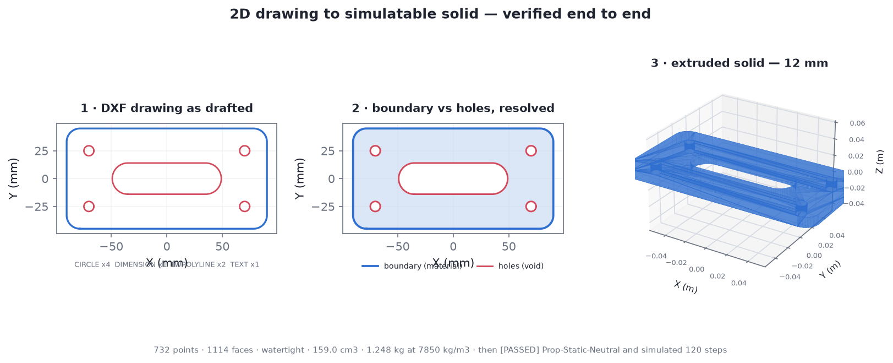

# 06 · 2D drawing → SimReady

A drawing goes in, a validated simulatable asset comes out, in one command:

```bash
./scripts/run_pipeline.sh examples/drawing/bracket.dxf
```

```
[1] Convert to USD          ✓ drawing_to_usd -> extruded solid (0.012 m thick)
                              units mm (x0.001 to m) · 6 loops, 5 holes
                              732 points / 1114 faces · 159.0 cm3 · 1.248 kg
[2] USD validation          ✓ no issues
[3] SimReady baseline       FAIL
[4] Apply conformance fixes ✓ wrote .out/bracket/conformed/bracket/bracket.usd
[5] SimReady re-validation  ✓ [PASSED] Prop-Static-Neutral v1.0.0
[6] Physics smoke test      ✓ SIMULATED 120 steps OK

pipeline OK
```

---

## Scope — read this before anything else

**There is no NVIDIA skill for 2D → 3D.** `usd-convert-cad` handles STEP, JT, DGN and
HOOPS — all *3D* CAD. Nothing in the 147-unit catalog goes from a drawing to a solid.
`scripts/drawing_to_usd.py` fills that gap, and it fills exactly one shape of it.

| | |
|---|---|
| ✅ **Prismatic parts** — one closed profile extruded to constant thickness | plates, brackets, gaskets, shims, laser/waterjet parts, sheet metal flats, machined flats |
| ✅ Fillets, arcs, circles, slots, any number of holes | DXF bulges and `CIRCLE` are tessellated |
| ✅ Units resolved from the drawing | `$INSUNITS`, or `--units` |
| ❌ **Three orthographic views → solid** | an open research problem; do not expect it |
| ❌ Revolved, swept or lofted bodies | a turned shaft is not an extrusion |
| ❌ Variable thickness, drafted walls, ribs | |
| ❌ Multiple separate parts in one drawing | reported as a warning, not silently merged |
| ❌ Islands inside holes | would need an even-odd depth walk |

Profiles stored as loose `LINE`/`ARC` segments rather than a closed polyline — very common
in exported drawings — are handled by opt-in chaining (`--chain-tolerance`), see below.

If your drawings are the second group, this is the wrong tool and no amount of flags will
change that. The honest options there are a real CAD kernel (build the solid in CAD, then
`usd-convert-cad`) or a human modelling pass.

The good news: in mechanical work the first group is a large share of parts, and it is
precisely the share that is tedious enough to be worth automating.

---

## Where the drawing step sits

Only the first box is new. Everything after it is the pipeline already verified in
[`02-verified-findings.md`](02-verified-findings.md), unchanged.

```
 bracket.dxf
     │
     ├─ drawing_to_usd.py ────────►  USD Mesh + rigid body + collider + mass
     │   (new — no NVIDIA skill        watertight, consistently wound
     │    covers this step)
     │
     ├─ nvidia_usd_validate ──────►  PASS
     ├─ simready-validate ────────►  FAIL — NP.005 NP.006 GSP.001 PMT.001
     ├─ simready_conform.py ──────►  flatten + 4 fixes
     ├─ simready-validate ────────►  PASS — 5/5 features
     └─ ovphysx ──────────────────►  120 steps, stable
```



---

## Inside `drawing_to_usd.py`

### 1. Units

CAD is almost never in metres; USD stages here are. Getting this wrong yields a part
1000× too large that passes every validator and behaves absurdly in physics — so the
factor is resolved explicitly from `$INSUNITS` and always printed.

```
units mm (x0.001 to m)
```

Unitless drawings (`$INSUNITS = 0`) are common. The script assumes mm and says so on
stderr rather than pretending to know. `--units` overrides.

### 2. Closed loops only

An extrusion needs a closed boundary. `LWPOLYLINE` (closed), `POLYLINE` (closed) and
`CIRCLE` qualify on their own. Loose `LINE`/`ARC`/`SPLINE` segments do not — they are
listed in `ignored_entities` unless you opt into chaining with `--chain-tolerance`, which
joins them end-to-end within a distance you specify.

That is opt-in rather than automatic on purpose: chaining needs a tolerance, and a wrong
tolerance does not error, it produces a *different part* — too small leaves the profile
open, too large welds shut a gap that was meant to be there. The report always states how
many segments were joined and how many remain unjoined.

Dimensions, text and hatches are ignored by design. The bundled test drawing includes a
`DIMENSION` and a `TEXT` specifically to prove it.

### 3. Boundary vs holes

The largest-area loop is the boundary; loops whose centroid falls inside it are holes.
Anything else is reported as `loops_outside_boundary` — a separate part, which this tool
does not merge.

### 4. Winding — the bug worth knowing about

Orientation is normalised first: boundary CCW, holes CW. Then **one wall formula serves
every loop**. Flipping holes a second time (which looks right — a hole's wall does face
the opposite way) double-reverses them, and every hole edge ends up traversed identically
by its cap and its wall.

`nvidia_usd_validate` catches it as a *warning*:

```
[ManifoldChecker] The face winding is not consistent.  At Prim </bracket/Geometry/bracket_solid>
Failures: 0    Warnings: 1
```

**and still exits 1.** That is worth internalising for CI: `Failures: 0` does not mean the
tool succeeded — read the exit code, not the summary line.

Both properties are asserted directly in the test suite: every undirected edge is used
exactly twice (watertight) and no directed edge appears twice (consistent winding).

### 5. Mass from geometry

Volume comes from the profile area minus hole areas, times thickness; mass is volume ×
density. For the bundled bracket:

```
159.0 cm3 · 1.248 kg at 7850 kg/m3
```

which matches the by-hand figure (180×90×12 plate, less fillet corners, four Ø9 holes and
a 70×28 slot). Density defaults to steel; `--density` changes it. Getting mass right
matters — it is what makes the part fall correctly rather than merely exist.

---

## Two constraints that shape the output format

These bit during development and are not documented anywhere obvious.

### `simready-validate` ignores `.usdc` entirely

```python
# simready/validate/api.py:395
suffix = asset_path_p.suffix.lower()
if suffix not in [".usd", ".usda"]:
```

A `.usdc` asset produces an **empty report `{}`** — no features evaluated, nothing said
about why. Exit is 1, so a CI gate does catch it, but the reason is invisible.

### …while `nvidia_usd_validate` rejects a large `.usda`

```
[UsdAsciiPerformanceChecker] 3 attribute(s) have large array lengths and should be
stored in crate files for improved performance.
```

A tessellated solid is thousands of floats. So for mesh-heavy assets the two validators
want **opposite containers**.

**`.usd` resolves both**: the extension is on `simready-validate`'s allow-list, and USD
writes `.usd` as crate, so the arrays are never ASCII. `simready_conform.py --format auto`
picks `.usd` when the stage holds large arrays and stays `.usda` otherwise, so plain props
remain readable in a text editor.

---

## Why a single part needs its own profile

Every stock `Prop-*` profile includes `FET004` (Simulate Multi-Body Physics), whose
`RB.MB.001` requires *"at least two physics rigid bodies"*. An extruded plate has one. It
cannot pass, no matter how correct it is.

NVIDIA's own `profiles.toml` marks the feature optional — in a comment:

```toml
{"FET004_BASE_NEUTRAL" = {version = "0.1.0"}},  # "... (This is an optional feature
                                                #  for this profile)"
```

But the feature JSON carries only `id`, `version`, `display_name`, `path`, `dependencies`
and `requirements`. **There is no optional flag**, so `simready-validate` enforces it like
any other requirement. The comment states an intent the format cannot express, and tooling
cannot honour intent it cannot read.

[`profiles/prop-static.toml`](../profiles/prop-static.toml) writes that intent in a form
the validator does read — stock `Prop-Robotics-Neutral` minus `FET004`, nothing else:

```toml
[Prop-Static-Neutral]
"1.0.0" = {features = [
    {"FET000_CORE"         = {version = "0.1.0"}},
    {"FET001_BASE_NEUTRAL" = {version = "0.1.0"}},
    {"FET003_BASE_NEUTRAL" = {version = "0.1.0"}},
    {"FET005_BASE_NEUTRAL" = {version = "0.1.0"}},
    {"FET006_BASE_MDL"     = {version = "0.1.0"}},
]}
```

`--profiles-path` is repeatable, so this **adds** to the stock set rather than replacing
it. `run_pipeline.sh` passes both and defaults `.dxf` inputs to this profile.

This is the documented extension path — the same thing
`simready-foundation-add-profile` exists to do. Use the stock profiles for anything with
joints.

---

## Running it on your own drawing

### Step 1 — inspect before converting

Always start here. Production drawings carry title blocks, centre lines and often several
parts, and the converter only extrudes *closed* profiles. `inspect_dxf.py` reads the file
and reports what it found — it never writes to it.

```bash
.venv-ov/bin/python scripts/inspect_dxf.py mypart.dxf
```

```
file      : mypart.dxf  (37 KB)
units     : NOT DECLARED ($INSUNITS=0) — drawing_to_usd will assume mm
entities  : 10 across 5 layer(s)

  layer                closed  open  noise  entity mix
  -------------------- ------ ----- ------  ----------------------------------------
  BORDER                    1     0      1  LWPOLYLINEx1 TEXTx1 <-- geometry
  CENTER                    0     2      0  LINEx2  (chainable?)
  HOLES                     1     0      0  CIRCLEx1 <-- geometry
  OUTLINE                   0     4      0  ARCx2 LINEx2  (chainable?)
  PART2                     1     0      0  LWPOLYLINEx1 <-- geometry

closed profiles found : 3
  extents             : 400 x 240 unitless   (400.0 x 240.0 mm)
  profile area        : 923.48 cm2
      at  6 mm thick   ->   554.1 cm3,  4.350 kg steel / 1.496 kg aluminium

  WARNING: the largest loop is a near-full-sheet rectangle on 'BORDER' —
           this looks like a drawing frame, not the part.
           It is excluded from the suggestion below.

  layers with open segments only: CENTER, OUTLINE
    A profile drawn as loose lines/arcs lands here. If your part is
    one of these, add --chain-tolerance (in drawing units) to join it.
```

The **closed** column is the number that decides everything. A layer with `0 closed` and
a non-zero `open` count holds a profile drawn as separate lines and arcs — common in
exported and exploded drawings, and fixable (step 2).

The mass preview at three thicknesses is the cheapest sanity check available: if you know
roughly what the part weighs and none of the numbers are close, your units are wrong.

### Step 2 — convert

Point `--layers` at the part and nothing else. Add `--chain-tolerance` only if the
inspector said the profile is open:

```bash
DXF_THICKNESS=0.006 DXF_LAYERS=OUTLINE,HOLES DXF_UNITS=mm DXF_CHAIN_TOL=0.01 \
  ./scripts/run_pipeline.sh mypart.dxf
```

```
[1] Convert to USD          ✓ drawing_to_usd -> extruded solid (0.006 m thick)
                              units mm (x0.001 to m) · 2 loops, 1 holes
                              244 points / 366 faces · 35.8 cm3 · 0.281 kg
...
[5] SimReady re-validation  ✓ [PASSED] Prop-Static-Neutral v1.0.0
[6] Physics smoke test      ✓ SIMULATED 120 steps OK
pipeline OK
```

The bundled `examples/drawing/messy.dxf` reproduces exactly this — it deliberately has no
declared units, an outline exploded into two lines and two arcs, a title block and a
second unrelated part.

### About `--chain-tolerance`

It is off by default and never applied automatically, because a wrong tolerance does not
error — it produces a *different part*. Too small leaves the profile open; too large welds
shut a gap that was meant to be there.

Start at roughly the drawing's own precision (0.01 mm for mechanical work), and read the
report: `chained N open segment(s) into M loop(s)` and any `still unjoined` count tell you
whether it did what you wanted. Joining the outline into a single closed polyline in your
CAD tool is always the more reliable fix.

### Getting the file into a remote session

If you are running this in a cloud session rather than locally, the drawing has to reach
the container somehow:

| How | When it fits |
|---|---|
| **Commit it to the branch** — `cp mypart.dxf examples/drawing/`, commit, push; the session pulls | simplest, and keeps the test reproducible. Not for confidential drawings |
| **Attach it to a chat message** | quickest for a one-off check |
| **Run locally** — clone the branch, `./scripts/bootstrap_env.sh`, run | the right answer for drawings that should not leave your machine. Everything here is CPU-only and needs no API key |

Nothing in this pipeline calls out to a network service, so the local route loses no
functionality.

---

## Usage

```bash
# whole pipeline, defaults to 12 mm steel
./scripts/run_pipeline.sh examples/drawing/bracket.dxf

# different thickness and material
DXF_THICKNESS=0.003 DXF_DENSITY=2700 ./scripts/run_pipeline.sh part.dxf   # 3 mm aluminium

# converter alone
.venv-ov/bin/python scripts/drawing_to_usd.py part.dxf out/ \
    --thickness 0.006 --units mm --density 7850 \
    --layers PROFILE,HOLES --arc-segment-deg 3 --report out/drawing.json
```

`--layers` matters on real drawings, where construction lines, centre lines and borders
share the file with the part. Restrict to the layers that carry geometry.

`--arc-segment-deg` trades face count for roundness: 6° is the default, 3° doubles the
vertices on every arc.

### Regenerating the test drawing

```bash
.venv-ov/bin/python examples/drawing/make_bracket_dxf.py examples/drawing/bracket.dxf
```

---

## When the file is a whole drawing set

Production drawings are frequently a *set* — several framed sheets tiled into one
modelspace, each with title block, BOM and multiple views. The inspector says so first:

```
  VERDICT: this looks like an assembly / multi-sheet drawing SET, not a single part.
           3 sheet-frame rectangles: 6300x4455, 3360x2376, 2100x1485
           351 block references (INSERT), 9 dimensions
```

The detection is two signals: **two or more large 4-point rectangles** (sheet frames at
different scales), or **many `INSERT` block references alongside dimensions**.

This matters because nothing downstream would complain. The largest frame wins the
boundary contest, so the pipeline cheerfully extrudes the title block — on one real
drawing that produced a "2637 kg part" that was, geometrically, the border.

To see what you actually have:

```bash
python scripts/render_dxf.py yourfile.dxf --out .out/look --split
```

`render_dxf.py` draws the sheet through ezdxf's own backend, so blocks are expanded
properly, then splits it into regions along the empty gaps — one PNG per sheet. It
renders once and crops, because re-rendering per region on a real set takes minutes.

Then:

- **A flat part is in there** → isolate that one view into its own DXF (in CAD: copy the
  outline to a new file) and run the pipeline on that.
- **The subject is 3D equipment or piping** → 2D extrusion is the wrong shape of tool
  entirely. Build the solid in CAD or a plant-design package, export STEP/JT, and bring it
  in through `usd-convert-cad`.

---

## Attaching other drawing formats

The DXF path is the foundation; other inputs reach it by converting first. None of these
adapters are implemented here.

| Input | Route |
|---|---|
| **DWG** | `ODAFileConverter` (free, headless) → DXF, then unchanged |
| **PDF (vector)** | `pdf2dxf` / Inkscape → DXF. Check units — PDFs usually carry points, so pass `--units` |
| **PDF (scanned) / raster** | vectorise first (`potrace`, or a CAD tool's raster-to-vector). Expect to clean up: traced outlines are rarely closed, and this converter requires closed loops |
| **SVG** | SVG → DXF via Inkscape; same units caveat |

The unit question is where these go wrong most often, which is why the converter reports
its resolved scale on every run.

---

## What to check on your own drawings

1. **Units.** Confirm the reported unit and scale match your intent. Everything downstream
   inherits this.
2. **Loop count.** `6 loops = 1 boundary + 5 holes` should match what you see. If holes
   are missing, they are probably open polylines or on an excluded layer.
3. **`ignored_entities`.** Non-empty means geometry was skipped — check whether it
   mattered.
4. **`loops_outside_boundary`.** Non-zero means multiple parts in one drawing; split it.
5. **Mass.** Compare against the part's real weight if you know it. A 1000× error here is
   the units problem, and it is the single most likely mistake.

## Troubleshooting

| Symptom | Cause | Fix |
|---|---|---|
| `VERDICT: assembly / multi-sheet drawing SET` | several framed sheets in one modelspace | see below — this tool is for one part |
| `no closed profiles found` | outline drawn as separate lines/arcs | `--chain-tolerance 0.01`, or join it in CAD |
| same, and no open segments either | geometry is in a block or paperspace | explode the block, or move it to modelspace |
| part is 1000× too big or small | units wrong or undeclared | `--units mm` — check the inspector's mass preview |
| boundary is the whole sheet | the title block became the boundary | exclude that layer with `--layers` |
| `loops outside boundary` > 0 | several parts in one file | split the drawing, one part per file |
| conversion works, `[FAILED]` on a `Prop-*` profile | single body cannot satisfy `FET004` | use `Prop-Static-Neutral` (the `.dxf` default) |
| `ERROR: not a readable DXF` | it is a DWG | `ODAFileConverter in.dwg out.dxf` |
| `still unjoined at tol=...` | gaps larger than the tolerance | raise it, but check the report — too large welds real gaps shut |
