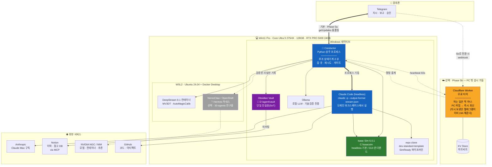
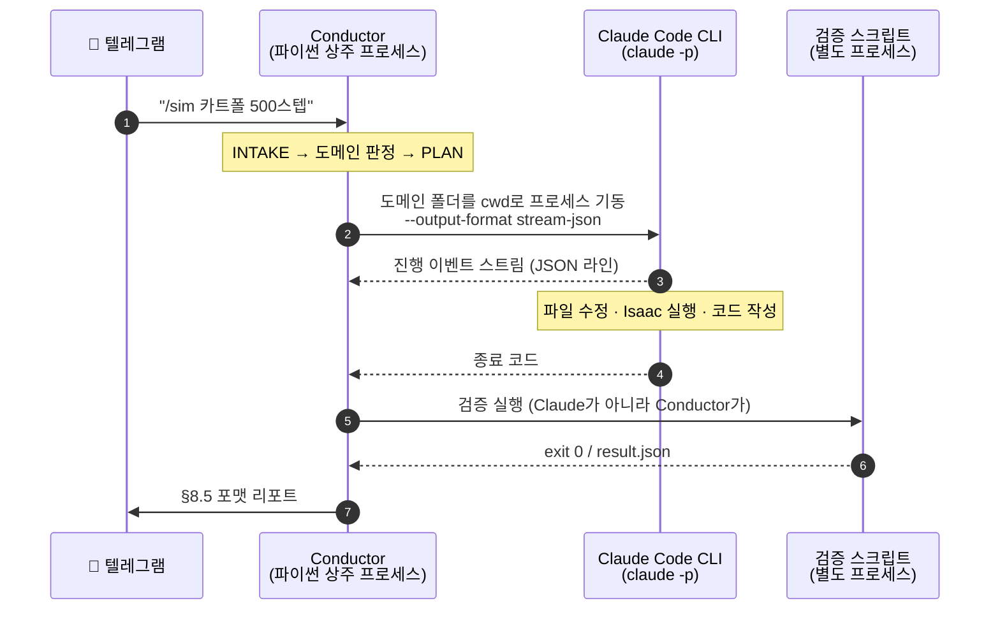
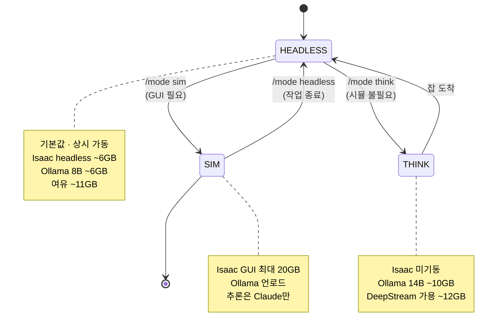
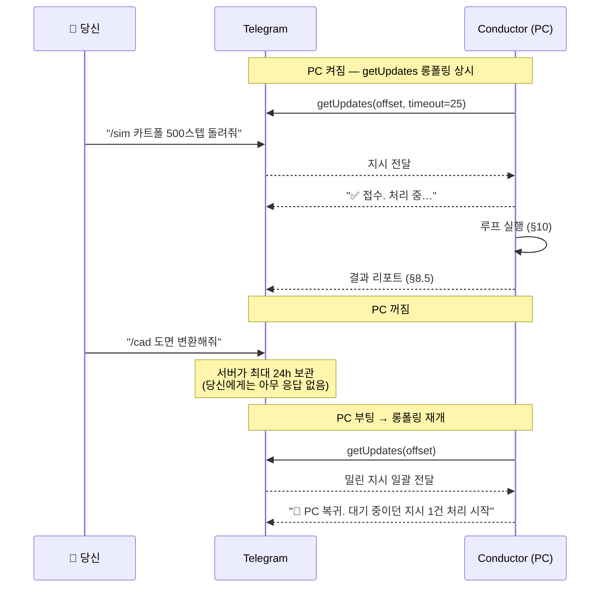
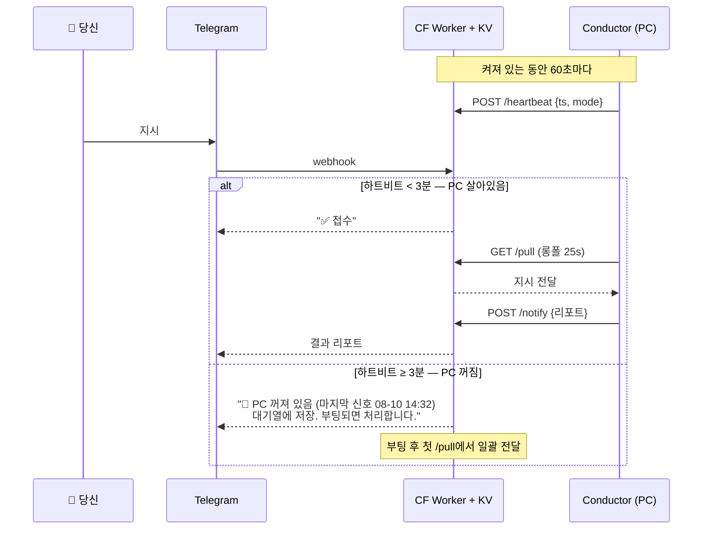
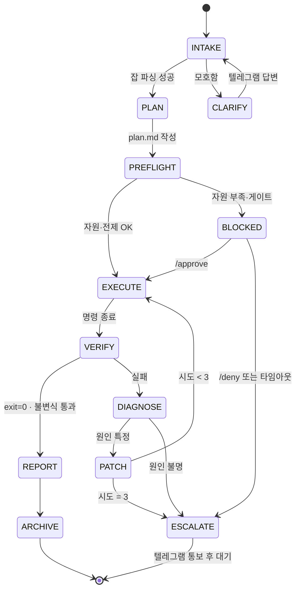
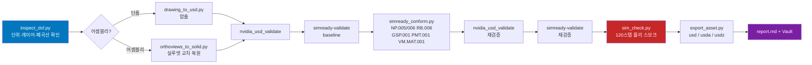
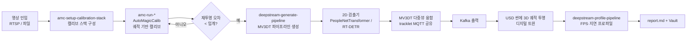
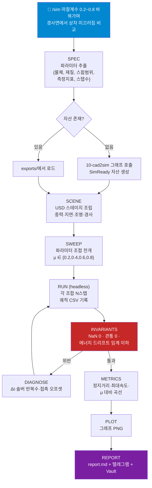
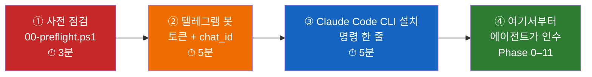

# 07 — 상시 가동 에이전트 PC 설계서

> 대상: **Windows 11 Pro만 깔려 있고 Claude Desktop 하나만 설치된 모바일 워크스테이션**
> 목표: 이 PC를 **제2의 뇌 + 상시 가동 자율 에이전트**로 만든다.
> 기준일: **2026-08-10**
> 이 문서는 설계서다. 구현 스크립트는 `bootstrap/` (Phase 13에서 생성)에 들어간다.

---

## 0. 이 문서를 읽는 법

| 당신이 알고 싶은 것 | 읽을 절 |
|---|---|
| 지금 NVIDIA 스택이 어디까지 왔나 | [§1](#1-2026-08-10-기준-nvidia-스택-현황) |
| 내 노트북이 이 일을 감당하나 | [§2](#2-하드웨어-판독--당신의-pc가-실제로-무엇인가), [§4](#4-vram-24gb-예산-설계) |
| 전체 그림 | [§3](#3-전체-시스템-구성도) |
| Obsidian이 뭔지 하나도 모르겠다 | [§6](#6-obsidian-완전-입문) |
| 환각은 어떻게 막나 | [§9](#9-도메인-워크스페이스-스키마--환각-방지-규약) |
| 에이전트가 혼자 어떻게 도나 | [§10](#10-루프-엔지니어링--상태기계), [§11](#11-그래프-엔지니어링--도메인별-dag) |
| **지금 당장 내가 뭘 해야 하나** | [§17](#17-지금-당장-사람이-할-일) ← 여기부터 |
| 뭐부터 깔면 되나 | [§13](#13-단계별-구축-순서) |
| 뭘 가입해야 하나 | [§14](#14-필요-계정과-키-목록) |
| 이 문서에서 뭐가 검증됐고 뭐가 추정인가 | [§15](#15-검증된-것과-추정인-것) |

### 이 설계가 지키는 사용자 결정사항

당신이 명시한 것들이다. 설계 전체가 여기에 종속된다.

1. **추론은 Claude가 주력.** 로컬 LLM은 기술 검토·검증용으로 가볍게만.
2. **Claude Max 구독** 사용 (API 종량과금 아님).
3. **보안 워크스페이스 분리 안 함.** 사내/공용 구분 없음. 보안은 당신이 관리.
4. **Obsidian이 단일 진실원(SoT).** Notion은 이력·참고 DB.
5. **텔레그램**이 유일한 지시/보고 채널.
6. **PC가 꺼져 있으면 텔레그램으로 "PC 꺼짐" 회신.**
7. **유료 API 호출과 PR 생성만 최종 승인**, 나머지는 완전 자율.
8. **Isaac Sim 6.0.1**이 주 작업 대상.
9. API 키는 보내준 것 그대로 사용. 단 **값은 파일/문서에 커밋하지 않고** `.env` + OS 자격증명 저장소로 참조.

---

## 1. 2026-08-10 기준 NVIDIA 스택 현황

당신이 지적한 대로 이전 정리는 뒤처져 있었다. 현재 기준으로 다시 세운다.

### 1.1 시뮬레이션 / Physical AI

| 항목 | 현재 버전·상태 | 이 설계에서의 역할 |
|---|---|---|
| **Isaac Sim** | **6.0.1 GA** (Kit SDK 110.1.2). `isaacsim.replicator.nurec_utils` 추가 | 주 작업 엔진. `50-physics`, `10-cad2sim` 도메인 |
| **Isaac Lab** | Isaac Sim 6.x 대응 | 강화학습 실험 (후순위) |
| **Newton / Warp** | Isaac Sim 6.x 내장 물리 솔버 | 강체·연성체·유체 실험 |
| **OpenUSD** | `usd-exchange`가 자체 벤더링 (`pxrInternal_v0_25_5`) | 자산 표준. **`usd-core`와 절대 동거 불가** (본 repo `CLAUDE.md` 참조) |
| **SimReady 규격** | Requirements → Capabilities → Features(52) → Profiles(9) 4계층 | 자산 적합성 판정 기준 |
| **Cosmos 3 Edge** | 4B 월드 모델 + 2B Nemotron 리즈너 | 엣지용 월드 모델. 24GB VRAM에 실제로 올라갈 수 있는 급 |
| **GR00T** | 휴머노이드 파운데이션 모델 | 참고 도메인 (`30-agents`) |
| **Jetson Thor** | T3000 / T2000, **JetPack 7.2** | 현재 PC엔 무관. 나중에 엣지 배포 시 |
| **Halos** | 자율주행 안전 스택 | 참고 |
| **LeRobot / RoboLab** | HF 협업 로보틱스 툴체인 | 참고 |

### 1.2 DeepStream 9.1 — 당신이 지적한 부분

이전 조사에서 `amc-*` 스킬만 발견하고 **DeepStream 9.1과 연결짓지 못한 것은 명백한 누락**이었다. 정리한다.

| 기능 | 내용 | `20-digitaltwin` 도메인에서의 쓰임 |
|---|---|---|
| **MV3DT** (Multi-View 3D Tracking) | 다중 카메라에서 동일 객체를 3D 좌표계 하나로 통합 추적. 카메라 간 **MQTT로 tracklet 공유**, 결과는 **Kafka**로 방출 | CCTV 여러 대 → 하나의 3D 디지털 트윈 좌표계. 이게 "자율운영 디지털 트윈"의 핵심 |
| **AutoMagicCalib** | 객체 이동 궤적만 보고 카메라 캘리브레이션 자동 산출. 체커보드 불필요. 옵션으로 **VGGT** 사용 | 현장 카메라 설치 후 수작업 캘리브 제거 |
| 2D 검출기 | PeopleNetTransformer, PeopleNet v2.6.3, RT-DETR | MV3DT의 입력단 |
| 에이전트 스킬 | `deepstream-dev`, `deepstream-generate-pipeline`, `deepstream-import-vision-model`, `deepstream-profile-pipeline`, `deepstream-sop`, `amc-run-*`(2), `amc-setup-calibration-stack` | Claude Code에 설치해서 파이프라인을 에이전트가 직접 생성/프로파일링 |

> **주의:** DeepStream은 리눅스 스택이다. 이 PC에서는 **WSL2 + Docker Desktop** 안에서 컨테이너로 돌린다. 네이티브 Windows 설치 경로는 없다.

### 1.3 에이전트 인프라

| 항목 | 현재 | 역할 |
|---|---|---|
| **NVIDIA Agent Skills** (`nvidia/skills`) | Physical AI, DeepStream, Jetson, TAO, DOCA 등 수백 개. Claude Code / Codex / Cursor 대응 | Claude Code에 직접 설치. `omniverse-cad-to-simready`, `omniverse-realtime-viewer`, `omniverse-usd-performance-tuning`, `deepstream-*`, `amc-*` |
| **NeMo Agent Toolkit** | `nvidia-nat` **1.8** (`pip install nvidia-nat`, `[langchain]` 등 extras) | 루프 관측·프로파일링 계층 (선택, Phase 11 이후) |
| **NemoClaw** | OpenShell 샌드박스 + 관리형 Nemotron 추론 + Privacy Router + 네트워크 정책 + 스냅샷. Hermes / LangChain Deep Agents Code / OpenClaw 하네스를 구동 | **선택.** `30-agents` 도메인의 연구 대상 (§1.4) |
| **Hermes** | **Nous Research**가 만든 에이전트 하네스. 쓸수록 스스로 메모리와 스킬을 써 나가는 자가 진화형 | **선택.** 주력 코딩에는 쓰지 않는다 — 이유는 §1.4 |
| **Notion MCP** | `https://mcp.notion.com/mcp` (streamable HTTP, OAuth) | Notion 미러링. Claude Max 구독으로 사용 가능 |

> **용어 정정:** "Omniverse Agent Toolkit"이라는 단일 제품은 없다. 당신이 말한 것에 해당하는 실체는 셋으로 갈린다 — ① `nvidia/skills`의 `omniverse-*` 스킬, ② `NVIDIA-Omniverse/kit-usd-agents` (Kit 안에서 도는 USD 에이전트 베이스), ③ `NVIDIA-Omniverse/usd-content-agents` (VLM으로 머티리얼·물리속성 자동 배정). 이 설계는 ①을 주력으로, ③을 `10-cad2sim`의 보조로 쓴다.

### 1.4 왜 Hermes가 아니라 Claude Code인가

초안에서는 Hermes를 주력 실행기로 넣었다. 사용자의 통합 요구 목록에 들어 있었기 때문이지, 아키텍처가 요구해서가 아니었다. 확인해 보니 **주력으로 쓸 수 없는 이유가 하나 있다.**

| 확인한 사실 | 결과 |
|---|---|
| NemoClaw는 추론 공급자를 **OpenAI 호환 엔드포인트**(`https://inference.local/v1`)로 설정한다 | 하네스는 OpenAI 호환 API를 요구한다 |
| **Claude Max 구독은 API 엔드포인트가 아니다** — Claude Code / Claude Desktop에서 쓰는 구독이다 | Hermes에 Claude Max를 꽂을 수 없다 |
| Hermes에 Claude를 물리려면 **Anthropic API 키(종량과금)** 가 별도로 필요하다 | 결제수단 제약에 걸린다 |

즉 **Hermes를 주력으로 쓰면 Opus가 아니라 Nemotron으로 코딩하게 된다.** 이미 구독 중인 최상급 모델을 두고 내려가는 선택이므로, 주력은 Claude Code로 확정한다.

**코딩·검증 품질을 올리는 건 하네스 교체가 아니라 루프를 조이는 것이다.** §10의 네 가지 — 검증을 실행과 다른 프로세스가 수행, 측정 불가능한 성공기준 거부, `result.json`에 없는 수치 인용 금지, 실패 로그 원문 전달 — 이게 없으면 어떤 하네스를 얹어도 품질은 오르지 않는다. 반대로 이게 있으면 Hermes 없이 충분하다.

**Hermes가 실제로 쓸모 있는 자리:** 쓸수록 스스로 메모리와 스킬을 축적하는 자가 진화 구조가 Hermes의 특징이다. 이건 주력 코딩이 아니라 **`30-agents` 도메인의 관찰 대상**으로 맞다 — NIM 무료 크레딧으로 돌려보고, 쓸 만한 패턴을 Conductor에 이식한다. 격리 샌드박스에서 위험한 자율 실행을 시험하는 용도로도 맞다. **Phase 7에서 선택 항목으로 둔다.**

---

## 2. 하드웨어 판독 — 당신의 PC가 실제로 무엇인가

당신이 준 사양과 "가끔 뚜껑이 닫혀 있다"는 말을 합치면 결론이 나온다.

| 당신이 말한 것 | 실제 정체 (추정) | 근거 |
|---|---|---|
| "Blackwell Pro 5000, 24GB" | **RTX PRO 5000 Blackwell Laptop GPU (24GB GDDR7)** | 데스크톱 RTX PRO 5000 Blackwell은 48GB다. 24GB는 랩톱 변종 |
| "i9 Ultra 24코어" | **Core Ultra 9 275HX** (24코어 = 8P+16E, Arrow Lake-HX) | HX는 모바일 워크스테이션 전용 |
| "뚜껑 닫혀 있고" | **모바일 워크스테이션(노트북)** | 결정적 단서 |
| 128GB RAM | SODIMM 2×64GB | HX 플랫폼 최대치 |

**운용 전제 (사용자 확인):** 평소에는 **AC 연결 + 뚜껑 열림 + 절전 없이 상시 가동.** 다만 **가끔 뚜껑을 닫거나 전원을 끈다.**

**이것이 설계에 미치는 영향 — 데스크톱이었다면 없었을 제약 3개:**

1. **뚜껑을 닫아도 절대 잠들면 안 된다.** Windows 기본값은 뚜껑 닫으면 절전이고, 이 기본값 하나로 상시 가동이 무너진다. AC/DC 양쪽 다 "아무것도 안 함"으로 바꾼다 (Phase 0). 반면 **화면은 꺼져도 무방하다** — 디스플레이 off는 연산을 멈추지 않는다. 뚜껑을 열어둔 채 상시 가동하므로 화면만 15분 뒤 끈다.
2. **발열·클럭 스로틀링이 실재한다.** 상시 가동 + Isaac Sim RTX 렌더는 노트북 쿨링에 부담이고, 뚜껑을 닫으면 배기가 더 나빠진다. → 기본 모드를 **headless**로 두고 GUI는 필요할 때만 (§4). 무거운 잡은 뚜껑을 열고 돌린다.
3. **전원이 빠지면 배터리 모드로 떨어진다.** 평소 AC이므로 예외 상황이지만, 배터리에서는 GPU 클럭이 급감한다. Conductor가 배터리를 감지하면 SIM 모드가 필요한 잡을 큐에 보류하고 텔레그램으로 알린다 (Phase 11-3).

**"가끔 끈다"는 텔레그램이 그냥 흡수한다.** 꺼져 있는 동안 보낸 지시는 텔레그램 서버가 최대 24시간 보관하고, 부팅 후 Conductor가 롱폴링을 재개하면 밀린 지시를 전부 받아간다. **PC를 꺼도 지시는 유실되지 않는다.** 꺼져 있는 그 순간에 "PC 꺼짐"이라고 *즉답*까지 받고 싶으면 §8.2의 Phase 5b를 얹는다 — 선택이다.

### Isaac Sim 6.0.1 요구사항 대비 위치

| 등급 | GPU | VRAM | RAM | 당신의 PC |
|---|---|---|---|---|
| 최소 | RTX 4080 | 16GB | 32GB | ✅ 상회 |
| 권장 | RTX 5080 | 16GB | 64GB | ✅ 상회 |
| 이상적 | RTX PRO 6000 Blackwell | 48GB | — | ❌ VRAM 절반 |

드라이버: **Windows 595.97 이상** 필요. `nvidia-smi`로 먼저 확인하고, 낮으면 Phase 0에서 갱신한다.

문서는 "프레임당 16MP를 넘게 렌더하는 씬에서는 16GB로 부족할 수 있다"고 경고한다. 24GB는 그 위지만 여유롭지는 않다. 그래서 §4의 VRAM 모드 전환이 선택이 아니라 필수다.

---

## 3. 전체 시스템 구성도



> 실선 굵은 화살표가 **기본 경로**다. 점선은 **선택 항목** — Cloudflare Worker(Phase 5b)와 NemoClaw/Hermes는 없어도 전체가 돌아간다.

### 3.1 각 구성요소가 존재하는 이유

| 구성요소 | 왜 필요한가 | 없으면 무슨 일이 나나 |
|---|---|---|
| **Conductor** | 루프의 상태를 소유하는 단일 주체. Claude Code는 세션마다 죽으므로 루프를 기억할 수 없다 | 재시도·게이트·이력이 사라짐. "완료했다"는 자기 보고만 남음 |
| **Claude Code CLI** | Conductor가 프로그램으로 호출할 수 있는 유일한 창구 (§3.2) | 텔레그램 지시가 실행으로 이어지지 않음 |
| **Obsidian Vault** | 에이전트가 직접 읽고 쓰는 **평문 파일** 기억장치 | 기억이 세션에 갇힘 → 매번 처음부터 → 환각 급증 |
| **Notion** | 사람이 보기 좋은 이력·참고 DB. 폰에서 조회 | 없어도 동작하지만 회고가 불편 |
| **도메인 워크스페이스** | 컨텍스트 오염 차단 | 2D→3D 작업 중 DeepStream 파일을 읽고 헛소리 |
| **로컬 LLM** | 오프라인·저비용 기술 검증. Claude 호출 아끼기 | 사소한 확인에도 Claude 왕복 |
| Cloudflare Worker *(선택)* | 꺼져 있을 때 "PC 꺼짐"이라고 **즉답**하는 것. 그것 하나 | 즉답이 없을 뿐, 지시는 유실되지 않는다 (§8.1) |
| NemoClaw/Hermes *(선택)* | 위험한 자율 실행의 샌드박스, 자가 진화 하네스 관찰 | 주력 경로에는 영향 없음 (§1.4) |

### 3.2 지시가 실제로 흐르는 경로 — 왜 CLI인가

"텔레그램으로 PC에 명령한다"는 말은 **텔레그램이 Claude Code에 직접 연결된다는 뜻이 아니다.** 사이에 Conductor가 있다.



이 사슬에서 **Conductor가 Claude Code를 프로세스로 띄울 수 있어야** 한다. 그래서 CLI가 필수다.

| 형태 | 프로그램으로 호출 가능? | 이 설계에서 |
|---|---|---|
| **Claude Code CLI** | ✅ `claude -p "..." --output-format stream-json` | **필수.** 자동화의 유일한 경로 |
| **VS Code 확장** | ❌ 에디터가 열려 있어야 하고 사람이 앉아 있어야 함 | 권장 — 당신이 직접 작업할 때. 내부적으로 같은 Claude Code다 |
| **Claude Desktop** | ❌ 대화만 가능. 셸 실행 불가 | 설계에서 역할 없음 |

무인 실행이므로 CLI 호출에는 `--allowedTools`와 `--permission-mode`를 함께 준다. 이게 없으면 권한 프롬프트에서 멈춰 서고, 폰에서는 그걸 눌러줄 방법이 없다. 승인이 필요한 건 §12의 두 게이트뿐이며, 그건 Conductor가 텔레그램으로 물어본다.

> **CLI와 VS Code 확장은 택일이 아니다.** 확장은 CLI 위에 얹힌 UI이고, 둘 다 같은 Max 구독으로 인증한다. CLI를 깔고, 앉아서 작업할 때 쓰려면 확장도 깐다.

---

## 4. VRAM 24GB 예산 설계

24GB는 **Isaac Sim GUI + 로컬 LLM 동시 상주가 안 되는 크기**다. 그래서 모드로 나눈다.

### 4.1 소비량 추정

| 워크로드 | VRAM | 비고 |
|---|---|---|
| Isaac Sim headless, 강체만 | 3–6 GB | RTX 렌더 없음. 대부분의 파이프라인 작업 |
| Isaac Sim GUI, 단순 씬 | 8–12 GB | 뷰포트 RTX |
| Isaac Sim GUI, 공장/창고 씬 | 14–20 GB | 여기서 24GB가 빠듯해짐 |
| Isaac Sim 유체(PBD 파티클) | +4–10 GB | 파티클 수에 비례. **GPU 필수** |
| Ollama 8B Q4 | ~6 GB | 기술검증용 하한 |
| Ollama 14B Q4 | ~10 GB | 기본 선택 |
| Ollama 20B MoE Q4 | ~13 GB | 상한 |
| DeepStream MV3DT 4채널 | 4–8 GB | 컨테이너 |
| Windows 데스크톱 | ~1 GB | 상시 |

### 4.2 세 가지 모드



**모드 전환 규칙 (Conductor가 자동 판단):**

| 들어온 잡 | 자동 선택 모드 |
|---|---|
| `10-cad2sim` 변환/검증 | HEADLESS |
| `50-physics` 실험 (수치 결과만) | HEADLESS |
| "화면 보고 싶다" / 렌더 산출물 요구 | SIM |
| `20-digitaltwin` DeepStream | THINK (GPU를 컨테이너에 양보) |
| 문서·설계·조사 | THINK |

**강제 규칙:** Ollama는 `OLLAMA_KEEP_ALIVE=5m`으로 두어 유휴 시 스스로 VRAM을 반납한다. SIM 모드 진입 시 Conductor가 `ollama stop <model>`을 먼저 호출하고, `nvidia-smi --query-gpu=memory.used`로 실제 반납을 **확인한 뒤** Isaac을 띄운다. 확인 없이 진행하면 Isaac이 OOM으로 죽는다.

---

## 5. 디스크와 디렉터리 레이아웃

```
C:\
├─ isaacsim\                     ← Isaac Sim 6.0.1 (설치 경로 고정, 공백 금지)
└─ Users\<you>\
   └─ .agent\
      ├─ secrets.env             ← API 키. ACL로 본인만. 절대 커밋 금지
      └─ state.json              ← Conductor 재시작 복구용

D:\agent\                        ← 두 번째 볼륨이 없으면 C:\agent
├─ vault\                        ← 📕 Obsidian Vault = 단일 진실원 (§6)
├─ domains\                      ← 🧱 도메인 워크스페이스 (§9)
│  ├─ 10-cad2sim\
│  ├─ 20-digitaltwin\
│  ├─ 30-agents\
│  ├─ 40-brain\
│  └─ 50-physics\
├─ conductor\                    ← 루프 오케스트레이터 (§10)
│  ├─ conductor.py
│  ├─ graphs\                    ← 도메인별 DAG 정의 (§11)
│  ├─ queue\
│  └─ logs\
├─ repos\
│  └─ dev-standard-template\     ← 이 repo clone. SimReady 파이프라인
├─ models\
│  └─ ollama\                    ← OLLAMA_MODELS
├─ isaac-assets\                 ← Isaac Sim 에셋 팩 (5분할, 100GB+)
└─ scratch\                      ← 임시. 주기적으로 비움
```

**용량 예산 (최소 확보량):**

| 항목 | 용량 |
|---|---|
| Isaac Sim 본체 | 50 GB |
| Isaac Sim 에셋 완전팩 | ~100 GB (5분할 zip + 압축해제) |
| WSL2 + Docker 이미지 (DeepStream 컨테이너 포함) | 60 GB |
| Ollama 모델 3–4개 | 40 GB |
| Vault + 런 아티팩트 (1년) | 20 GB |
| **합계** | **≈ 270 GB** |

> 두 번째 볼륨이 없다면 `D:\agent` → `C:\agent`로 치환하되, C 드라이브 여유가 300GB 미만이면 에셋 완전팩은 나중으로 미룬다 (Isaac Sim은 에셋 없이도 기동된다).

---

## 6. Obsidian 완전 입문

당신이 "Obsidian은 완전 처음이다, LLM 위키 개념인가?"라고 물었다. 답부터.

### 6.1 한 줄 정의

> **Obsidian은 "폴더 안의 마크다운 파일 뭉치"를 위키처럼 보여주는 뷰어다.**

핵심은 이거다. Obsidian은 데이터베이스가 아니다. 서버도 아니다. 클라우드도 아니다.
`D:\agent\vault\` 폴더에 있는 `.md` 텍스트 파일들이 전부다. Obsidian을 지워도 파일은 그대로 남는다.

### 6.2 "LLM 위키인가?" — 반은 맞다

| 당신의 짐작 | 실제 |
|---|---|
| LLM 위키 | Obsidian 자체는 LLM과 무관하다. 그냥 위키다 |
| — | 그런데 **에이전트 기억장치로는 최적**이다. 이유는 아래 |

**왜 에이전트 기억으로 최적인가:**

| 특성 | 결과 |
|---|---|
| 평문 마크다운 | 에이전트가 `Read`/`Write`/`Grep`으로 **직접** 읽고 쓴다. API·인증·레이트리밋 없음 |
| 로컬 파일 | 네트워크 끊겨도 동작. 응답 지연 0 |
| `[[위키링크]]` | 노트끼리 연결 → 에이전트가 관련 맥락을 따라갈 수 있음 |
| YAML frontmatter | 노트 하나하나가 구조화된 레코드가 됨 (§9.3의 사실 카드) |
| Git 친화 | 볼트 전체를 `git commit` → 기억의 버전 관리 |

Notion으로 이걸 하려면 매번 API 호출이고, 레이트리밋에 걸리고, 오프라인이면 죽는다. 그래서 **Obsidian = 진실원, Notion = 사람이 보는 창**으로 나누는 것이다.

### 6.3 알아야 할 개념 5개

| 용어 | 뜻 | 예 |
|---|---|---|
| **Vault (볼트)** | 노트가 들어있는 최상위 폴더. Obsidian은 볼트 단위로 연다 | `D:\agent\vault` |
| **Note (노트)** | `.md` 파일 하나 | `20-facts/FCT-2026-0810-001.md` |
| **`[[위키링크]]`** | 다른 노트로 가는 링크. 대상이 없으면 클릭 시 생성됨 | `근거: [[RUN-20260810-1432]]` |
| **Frontmatter** | 파일 맨 위 `---` 사이의 YAML. 노트의 메타데이터 | `domain: 50-physics` |
| **Graph View** | 링크로 이어진 노트들을 그래프로 그려줌 | 지식 구조 한눈에 |

### 6.4 설치할 플러그인 3개 (그 이상은 필요 없다)

| 플러그인 | 역할 | 왜 |
|---|---|---|
| **Dataview** | 노트를 DB처럼 질의. `TABLE domain, verified_on FROM "20-facts" WHERE confidence = "verified"` | 사실 카드를 표로 자동 집계. 대시보드가 공짜로 생김 |
| **Templater** | 노트 템플릿 자동 삽입 | 사실 카드·런 리포트 포맷 강제 |
| **Obsidian Git** | 볼트를 주기적으로 자동 커밋/푸시 | 기억의 백업과 되돌리기 |

> Obsidian Sync(유료)는 **불필요**하다. Git 플러그인 + GitHub 프라이빗 repo로 같은 일을 무료로 한다.

### 6.5 볼트 스키마

```
D:\agent\vault\
├─ 00-inbox\                  ← 분류 전 아무거나. 매일 비운다
├─ 10-domains\                ← 도메인별 상설 지식
│  ├─ 10-cad2sim\
│  │  ├─ _MOC.md              ← Map of Content = 이 도메인의 목차 노트
│  │  ├─ DXF 단위 해석.md
│  │  └─ 압출 와인딩 규칙.md
│  ├─ 20-digitaltwin\
│  ├─ 30-agents\
│  ├─ 40-brain\
│  └─ 50-physics\
├─ 20-facts\                  ← 🔒 검증된 사실 카드 (§9.3). 추가만, 수정 금지
│  └─ FCT-2026-0810-001.md
├─ 30-runs\                   ← 실행 리포트 (Conductor가 자동 생성)
│  └─ RUN-20260810-1432-cartpole.md
├─ 40-refs\                   ← 외부 문서 요약. 반드시 URL + 조회일 포함
├─ 50-daily\                  ← 일일 노트. 에이전트 저널
│  └─ 2026-08-10.md
└─ 90-meta\
   ├─ templates\              ← Templater 템플릿
   ├─ contracts\              ← 도메인 CLAUDE.md 원본
   └─ prompts\
```

**폴더 번호를 붙이는 이유:** 파일 탐색기와 Obsidian 사이드바에서 순서가 고정된다. 에이전트가 경로를 지어내도 번호가 틀리면 즉시 드러난다.

---

## 7. Notion 역할과 스키마

Notion은 **읽기 위주**다. 진실을 만들지 않고, Obsidian의 진실을 사람이 보기 좋게 비춘다.

### 7.1 데이터베이스 3개

| DB | 한 행 = | 주요 속성 |
|---|---|---|
| **Runs (실행 이력)** | 실행 1건 | 날짜, 도메인, 잡 이름, 상태(✅/❌/⏳), 소요시간, 재시도 횟수, 산출물 링크, Vault 노트 경로, 요약 3줄 |
| **Facts (사실 DB)** | 검증된 사실 1개 | ID, 도메인, 주장, 검증일, 검증 명령, exit code, 근거 런, 신뢰도 |
| **Refs (참고 DB)** | 외부 자료 1개 | 제목, URL, 조회일, 도메인, 버전(예: Isaac Sim 6.0.1), 핵심 요지 |

### 7.2 동기화 방향


**단방향이다.** Notion에서 편집한 내용은 Vault로 돌아오지 않는다. 양방향으로 만들면 충돌 해소 로직이 필요해지고, 그 순간 "진실원이 둘"이 되어 설계가 무너진다.

Notion에 수정하고 싶은 게 생기면 텔레그램으로 지시한다 → 에이전트가 Vault를 고치고 → 다시 미러링된다.

### 7.3 연결 방법

Notion MCP는 원격 서버(`https://mcp.notion.com/mcp`, streamable HTTP, OAuth)다. API 키를 만들 필요가 없다.

- Claude Desktop: 설정 → 커넥터에서 추가 (Pro/Max 플랜 필요 — 당신은 Max)
- Claude Code: `/mcp` → notion → OAuth 승인

> **함정:** OAuth를 통과해도 **페이지를 명시적으로 공유해야 한다.** Notion 페이지 → `···` → "연결 추가" → 해당 통합 선택. 이걸 빼먹으면 유효한 토큰인데도 `object not found`가 뜬다.

---

## 8. 텔레그램 I/O와 "PC 꺼짐" 응답 설계

### 8.1 텔레그램만으로 이미 되는 것 — 초안의 과설계 정정

초안은 Cloudflare Worker를 필수로 놓았다. 근거로 "지시 큐잉"을 들었는데, **그건 텔레그램이 이미 공짜로 해주고 있었다.**

> Bot API 문서 원문: *"Incoming updates are stored on the server until the bot receives them either way, but they will not be kept longer than 24 hours."*

즉 Conductor가 `getUpdates` 롱폴링만 해도 이렇게 된다.

| 상황 | 텔레그램만 (Phase 5a) |
|---|---|
| PC 꺼진 동안 지시를 보냄 | 텔레그램 서버가 24시간 보관 |
| PC 부팅 | 롱폴링 재개 → 밀린 지시 **전부 수신** |
| 지시 유실 | **없음** |
| 꺼져 있는 동안의 응답 | ❌ 조용함 |

**Worker가 실제로 사는 값은 딱 하나다: 꺼져 있을 때 "🔌 PC 꺼짐"이라고 즉시 답하는 것.** 그 외에는 아무것도 추가하지 않는다.

### 8.2 그래서 두 단계로 나눈다

| | Phase 5a — 텔레그램만 | Phase 5b — Worker 추가 *(선택)* |
|---|---|---|
| 수신 방식 | `getUpdates` 롱폴링 | `setWebhook` → Worker |
| 지시 유실 | 없음 | 없음 |
| 밀린 지시 처리 | ✅ 부팅 시 | ✅ 부팅 시 |
| 꺼짐 즉답 | ❌ | ✅ |
| 사람이 만들 계정 | 0개 추가 | +1 (Cloudflare, 무료·결제수단 불요) |
| 코드 | 0줄 추가 | ~80줄 |

**5a로 먼저 세운다.** 5b는 엄밀히 상위집합이라 나중에 얹어도 앞 단계가 바뀌지 않는다. 며칠 써보고 "껐을 때 조용한 게 답답하다" 싶으면 그때 올린다.

> **5a→5b 전환 시 반드시 알아야 할 것:** `getUpdates`와 `setWebhook`은 **동시 사용이 불가능하다.** 문서 원문: *"You will not be able to receive updates using getUpdates for as long as an outgoing webhook is set up."* 따라서 전환은 원자적으로 해야 한다 — Conductor의 롱폴링을 먼저 멈추고, `setWebhook`을 호출하고, Conductor를 Worker 풀링 모드로 재기동한다. 순서를 뒤집으면 그 사이에 온 지시가 어느 쪽에도 잡히지 않는다.

### 8.3 동작 — Phase 5a (기본)



### 8.3b 동작 — Phase 5b를 얹었을 때 (선택)



### 8.4 텔레그램 명령 규격

| 명령 | 하는 일 |
|---|---|
| `/status` | 모드, GPU 사용량, 실행 중 잡, 큐 길이, 마지막 런 결과 |
| `/sim <자연어>` | `50-physics` 도메인 그래프 기동 (§11.3) |
| `/cad <파일 또는 자연어>` | `10-cad2sim` 그래프 기동 |
| `/twin <자연어>` | `20-digitaltwin` 그래프 기동 |
| `/ask <질문>` | Vault 검색 후 답변. 실행 없음 |
| `/note <내용>` | `00-inbox`에 노트로 저장 |
| `/mode <headless\|sim\|think>` | VRAM 모드 강제 전환 |
| `/runs [n]` | 최근 n건 런 요약 |
| `/stop <job-id>` | 실행 중단 |
| `/approve <gate-id>` | 승인 대기 게이트 통과 (§12) |
| `/deny <gate-id> [사유]` | 게이트 거부 |

### 8.5 보고 포맷

에이전트가 보내는 모든 완료 보고는 **이 형식을 벗어날 수 없다.**

```
✅ RUN-20260810-1432-cartpole  [50-physics]

목표   카트폴 500스텝, 에너지 보존 확인
결과   PASS · 4m12s · 재시도 0회
수치   에너지 드리프트 0.31% (임계 2%)
       관통 0건 · NaN 0건
검증   sim_check.py exit=0
아티팩트 D:\agent\domains\50-physics\runs\20260810-1432-cartpole\
노트   [[RUN-20260810-1432-cartpole]]
```

실패 시:

```
❌ RUN-20260810-1502-fluid  [50-physics]

목표   유체 5만 파티클 200스텝
결과   FAIL · 시도 3/3 소진 · 에스컬레이션
마지막 오류 (원문):
  RuntimeError: CUDA out of memory. Tried to allocate 3.44 GiB
  (GPU 0; 23.99 GiB total; 21.10 GiB already allocated)
진단   SIM 모드였고 Ollama가 반납되지 않았음 (nvidia-smi 확인 로그 첨부)
제안   ① 파티클 2만으로 축소  ② THINK→SIM 전환 시 반납 확인 강제
지시 대기 중
```

> **핵심 규칙:** 오류는 **원문 그대로** 붙인다. 요약하거나 의역하면 진단이 불가능해진다. 이건 이 repo의 `CLAUDE.md`가 이미 강제하는 규칙과 동일하다.

---

## 9. 도메인 워크스페이스 스키마 — 환각 방지 규약

당신 요구: *"도메인별 워크스페이스 구조로 환각을 막아라."*

환각은 세 경로로 들어온다. 각각을 구조로 막는다.

| 환각 경로 | 구조적 차단 |
|---|---|
| ① 다른 도메인 파일을 잘못 참조 | **도메인 격리** (§9.1) |
| ② 실행하지 않은 결과를 지어냄 | **사실 카드 원장** (§9.3) |
| ③ 과거 실행 내용을 기억으로 왜곡 | **런 폴더 불변성** (§9.2) |

### 9.1 도메인 격리

```
D:\agent\domains\<도메인>\
├─ CLAUDE.md          ← 🔒 이 도메인의 계약서. 세션 시작 시 자동 로드
├─ inbox\             ← 원본 입력 (도면, 영상, 데이터). 읽기 전용 취급
├─ runs\              ← 실행 결과. 불변 (§9.2)
├─ scripts\           ← 이 도메인 전용 스크립트
├─ .venv\             ← 도메인 전용 파이썬 환경
└─ exports\           ← 다른 도메인에 공개하는 산출물. 이것만 교차 참조 허용
```

**Conductor는 Claude Code를 반드시 도메인 루트를 cwd로 하여 기동한다.**

```powershell
cd D:\agent\domains\50-physics
claude -p "<잡 프롬프트>" --output-format stream-json
```

각 도메인 `CLAUDE.md`의 공통 머리말:

```markdown
# 도메인 계약: 50-physics

## 경계
- 이 도메인 밖의 파일을 읽지 않는다.
  예외: 다른 도메인의 `exports/` 하위, 그리고 `D:\agent\vault\20-facts\`
- 다른 도메인에 쓰지 않는다. 넘길 것은 `exports/`에 둔다.

## 사실 규칙
- `20-facts/`에 있는 것만 "사실"로 단언한다.
- 문서/웹 출처는 "보고된 바로는"으로 표기하고 URL과 조회일을 함께 쓴다.
- 그 외 모든 것은 "추정"이며 ⚠ 를 붙인다.
- 명령 출력은 **원문 그대로** 붙인다. 요약 금지.

## 완료 규칙
- `runs/<id>/result.json`이 exit=0으로 존재하지 않으면 "완료"라고 쓰지 않는다.
- 검증은 실행과 **다른 프로세스**가 수행한다. 자기 보고는 검증이 아니다.
```

### 9.2 런 폴더 불변성

```
runs/20260810-1432-cartpole/
├─ plan.md          ← 실행 전에 씀. 목표·성공 기준·예상 시간
├─ cmd.log          ← 실행한 모든 명령과 stdout/stderr 원문
├─ result.json      ← 기계 판독용 결과. 이게 유일한 진실
├─ report.md        ← 사람용 요약. result.json에서만 생성
└─ artifacts\       ← USD, 이미지, CSV
```

**규칙:**
1. `result.json`이 쓰이는 순간 폴더 전체가 **동결**된다. 이후 수정 금지.
2. 다시 하려면 새 런 폴더를 만든다. 덮어쓰지 않는다.
3. `report.md`는 `result.json`의 필드만 인용한다. `result.json`에 없는 수치가 `report.md`에 있으면 그건 환각이다 — 자동 린터가 잡는다.

`result.json` 최소 스키마:

```json
{
  "run_id": "20260810-1432-cartpole",
  "domain": "50-physics",
  "goal": "카트폴 500스텝, 에너지 드리프트 < 2%",
  "started": "2026-08-10T14:32:11+09:00",
  "ended":   "2026-08-10T14:36:23+09:00",
  "attempts": 1,
  "status": "PASS",
  "verify": { "by": "sim_check.py", "exit": 0 },
  "metrics": { "energy_drift_pct": 0.31, "penetrations": 0, "nan_steps": 0 },
  "artifacts": ["artifacts/cartpole.usd", "artifacts/trajectory.csv"],
  "commands": ["python scripts/sim_check.py --steps 500 ..."]
}
```

### 9.3 사실 카드 원장

Vault `20-facts/`에 들어가는 노트 하나 = 검증된 사실 하나.

````markdown
---
id: FCT-2026-0810-001
domain: 50-physics
claim: "Isaac Sim 6.0.1 headless에서 카트폴 500스텝 에너지 드리프트는 0.31%"
confidence: verified        # verified | reported | assumed
verified_on: 2026-08-10
method: cmd
cmd: "python scripts/sim_check.py --steps 500 --asset cartpole.usd"
exit: 0
evidence: "[[RUN-20260810-1432-cartpole]]"
expires: 2027-08-10         # 버전이 바뀌면 재검증 필요
---

## 원문 출력

```
[sim_check] 500 steps in 4.02s
energy drift: 0.31%  (threshold 2.00%)
penetrations: 0
nan steps: 0
exit 0
```
````

**신뢰도 3단계와 그 의미:**

| 값 | 뜻 | 에이전트가 말할 수 있는 방식 |
|---|---|---|
| `verified` | 이 PC에서 명령을 돌려 exit code까지 확인 | "…이다" (단정) |
| `reported` | 공식 문서/릴리스 노트에 그렇게 쓰여 있음. 직접 확인 안 함 | "문서에 따르면 …라고 한다 (URL, 조회 2026-08-10)" |
| `assumed` | 추론·유추 | "⚠ 추정: …" |

**이게 환각 방지의 핵심 장치다.** 에이전트가 뭔가를 단정하려면 `verified` 카드가 있어야 하고, `verified` 카드를 만들려면 `cmd` + `exit` + 원문 출력이 있어야 한다. 지어낼 방법이 없다.

Dataview로 대시보드가 공짜로 나온다:

````markdown
```dataview
TABLE domain, claim, verified_on, confidence
FROM "20-facts"
WHERE confidence = "verified" AND expires > date(today)
SORT verified_on DESC
```
````

### 9.4 다섯 도메인

| 도메인 | 다루는 것 | 주 도구 | 성공 판정 |
|---|---|---|---|
| **10-cad2sim** | 2D 도면(DXF) → 3D → SimReady | 이 repo의 파이프라인, `omniverse-cad-to-simready`, `usd-content-agents` | `run_pipeline.sh` exit=0, SimReady 프로파일 전 항목 PASS |
| **20-digitaltwin** | CCTV 다중 카메라 → 3D 추적 → 자율운영 트윈 | DeepStream 9.1 MV3DT, AutoMagicCalib, `deepstream-*` / `amc-*` 스킬 | 캘리브 재투영 오차 임계 이하, tracklet ID 스위치율 임계 이하 |
| **30-agents** | 에이전트 기술 자체 (스킬·MCP·루프) | `nvidia/skills`, NeMo Agent Toolkit, NemoClaw/Hermes | 스킬 설치 후 실제 실행 성공, 서명 검증 통과 |
| **40-brain** | 제2의 뇌 (지식 축적·연결·회고) | Obsidian, Notion MCP, Dataview | 사실 카드 증가, 링크 밀도, 만료 카드 0 유지 |
| **50-physics** | Isaac Sim 물리 (강체·동역학·유체) | Isaac Sim 6.0.1, Newton/Warp | `sim_check.py` exit=0, 물리 불변식 통과 |

---

## 10. 루프 엔지니어링 — 상태기계

당신 요구: *"에이전트가 스스로 생각하고 검증하고 루프를 돌아 결과를 낸다."*

### 10.1 상태기계



### 10.2 각 상태의 계약

| 상태 | 입력 | 출력 | 실패 조건 |
|---|---|---|---|
| **INTAKE** | 텔레그램 원문 | `{domain, goal, params, success_criteria}` | 도메인 판정 불가 → CLARIFY |
| **PLAN** | 위 구조체 | `plan.md` (목표·단계·성공기준·예상시간·롤백) | 성공기준이 **측정 불가**하면 실패 |
| **PREFLIGHT** | plan | 자원 확인 결과 | VRAM 부족, 파일 없음, 게이트 필요 |
| **EXECUTE** | plan | `cmd.log` + 산출물 | 프로세스 비정상 종료, 타임아웃 |
| **VERIFY** | 산출물 | `result.json` | 별도 검증 스크립트 exit≠0 |
| **DIAGNOSE** | 실패 로그 원문 | 원인 가설 + 패치안 | 가설 없음 → ESCALATE |
| **PATCH** | 패치안 | 수정된 plan | — |
| **REPORT** | `result.json` | `report.md` + 텔레그램 + Vault 노트 | `result.json`에 없는 값 인용 시 린터가 차단 |
| **ARCHIVE** | 런 폴더 | 동결 + Notion 미러 | — |

### 10.3 절대 규칙 4개

> **① 검증은 실행과 다른 프로세스가 한다.**
> Claude Code가 스스로 "됐습니다"라고 하는 것은 검증이 아니다. Conductor가 **별도로** 검증 스크립트를 돌리고 exit code를 본다. 이 repo의 `run_pipeline.sh`가 마지막에 `sim_check.py`를 돌리는 것과 같은 원리다.

> **② 측정 불가능한 성공기준은 PLAN에서 거부한다.**
> "잘 작동하게" → 거부. "500스텝 동안 에너지 드리프트 2% 미만, NaN 0건" → 통과.

> **③ 재시도는 3회.** 4번째는 없다. 에스컬레이션하고 사람을 기다린다.
> 같은 실패를 무한 반복하며 토큰을 태우는 것이 자율성이 아니다.

> **④ 실패 로그는 원문 그대로 전달한다.**
> 요약·의역·"아마 …인 것 같습니다" 금지.

### 10.4 자기 검증(self-verification)의 실제 구현

DIAGNOSE 단계에서 **로컬 LLM을 쓴다.** Claude 호출을 아끼고 오프라인에서도 돌기 위해서다.

```
실패 로그 (원문)
  ↓
로컬 LLM (Ollama, 14B) — "이 로그에서 실패 원인 후보 3개와 각각의 확인 명령을 내라"
  ↓
확인 명령 실행 (nvidia-smi, dir, python -c import, …)  ← 실제 실행
  ↓
후보 좁혀짐
  ↓
Claude Code — 실제 패치 작성          ← 여기서만 Claude 사용
```

로컬 LLM은 **판단하지 않는다.** 확인할 것을 열거할 뿐이고, 확인은 명령이 한다. 이게 "로컬 LLM은 기술 검토·검증용으로 가볍게"라는 당신의 요구와 정확히 맞는다.

---

## 11. 그래프 엔지니어링 — 도메인별 DAG

루프가 "어떻게 도는가"라면, 그래프는 "무엇을 도는가"다. 도메인마다 고정 DAG를 미리 정의하고, 에이전트는 노드 안에서만 자유롭다.

> **왜 DAG를 고정하나:** 에이전트에게 "알아서 해"라고 하면 매번 다른 순서로 다른 걸 빼먹는다. 순서를 고정하면 빼먹을 수가 없고, 어느 노드에서 깨졌는지가 즉시 드러난다.

### 11.1 `10-cad2sim` — 2D 도면 → SimReady

이미 이 repo에 구현되어 있다. 그대로 노드화한다.



**게이트:** `inspect_dxf.py` 출력을 **읽기 전에는 변환 금지**. 이 repo의 `CLAUDE.md`가 이미 강제하는 규칙이다. `--layers`를 추측하면 사이클 하나를 버린다.

### 11.2 `20-digitaltwin` — CCTV → 3D 트윈



**전제:** WSL2 + Docker Desktop + GPU 패스스루가 서 있어야 한다 (Phase 7). GPU를 컨테이너에 넘기므로 이 그래프는 **THINK 모드**에서 돈다 (Isaac 미기동).

### 11.3 `50-physics` — 한 마디로 SimReady부터 리포트까지

당신이 요구한 것: *"한 번의 지시로 SimReady 생성 → 환경 세팅 → 실험 → 결과 리포트"*



**유체는 별도 분기다.** Isaac Sim의 파티클 유체(PBD)는 **GPU 필수**이고 VRAM을 크게 먹는다. SPEC에서 `fluid: true`가 감지되면:
- 모드를 SIM으로 강제 (Ollama 반납 확인)
- 파티클 수 상한을 VRAM 여유에서 역산
- 상한 초과 요청이면 PREFLIGHT에서 축소안을 제시하고 승인 요청

### 11.4 `30-agents` / `40-brain`

이 둘은 DAG가 얕다.

- **30-agents**: `스킬 발견 → 서명 검증 → 설치 → 실제 실행 → 결과를 사실 카드로 → 카탈로그 갱신`
  - 서명 검증: `pip install model-signing` 후 `nv-agent-root-cert.pem` 대조. 이 repo `CLAUDE.md`가 이미 요구하는 절차다.
- **40-brain**: `일일 스캔(00-inbox) → 분류 → 링크 제안 → 만료 임박 사실 카드 재검증 → 일일 노트 작성`
  - **매일 03:00 자동 실행.** 만료된 `verified` 카드를 다시 돌려서 갱신하거나 `reported`로 강등한다. 이게 지식이 썩는 것을 막는 유일한 장치다.

---

## 12. 자율성 경계

당신 지시: *"유료 API 사용과 PR에 대해서만 최종 검토, 나머지는 완전 자율."*

### 12.1 게이트 (승인 필요)

| 게이트 | 발동 조건 | 텔레그램 메시지 |
|---|---|---|
| `GATE-PAID` | 종량과금 API 호출 (NIM 유료 티어, NGC 유료 자산, 그 외 과금 발생 요청) | 예상 비용·용도·대안 제시 후 `/approve` 대기 |
| `GATE-PR` | GitHub PR 생성 또는 기본 브랜치 푸시 | 변경 요약 + diff 통계 후 `/approve` 대기 |

승인 대기는 **30분 타임아웃**. 지나면 잡을 BLOCKED로 두고 다음 잡으로 넘어간다. 무한 대기로 큐를 막지 않는다.

### 12.2 완전 자율 (승인 불요)

- 파일 생성·수정·삭제 (`D:\agent\` 및 도메인 워크스페이스 내)
- 무료 API·로컬 모델 호출, Claude Max 구독 내 호출
- 패키지 설치 (도메인 `.venv` 내부)
- Isaac Sim / DeepStream / NemoClaw 실행
- 브랜치 생성 및 **피처 브랜치** 푸시
- Obsidian Vault 쓰기, Notion 미러링
- 텔레그램 보고

### 12.3 항상 금지

- `C:\Windows`, 드라이버, 레지스트리 시스템 영역 변경
- 도메인 밖 파일 삭제
- `secrets.env` 내용을 로그·리포트·커밋에 출력
- 승인 없이 기본 브랜치에 푸시

> 당신이 "보안은 크게 신경쓰지 말라"고 했으므로 사내/공용 워크스페이스 분리, 네트워크 정책, 시크릿 스캐닝 게이트는 **만들지 않는다.** 위 3줄만 남긴다. 이건 보안이라기보다 "에이전트가 자기 발등을 찍지 않게 하는" 최소 안전장치다.

---

## 13. 단계별 구축 순서

**전제: Windows 11 Pro + Claude Desktop만 설치된 상태.**
각 Phase 끝의 **✔ 확인**을 통과해야 다음으로 간다. 통과 못 하면 멈추고 텔레그램으로 보고한다.

> 아래 `winget` 패키지 ID 중 `Ollama.Ollama`와 `Anthropic.ClaudeCode`는 공식 문서에서 확인했다. 나머지는 표준 ID이지만 실행 전 `winget search <이름>`으로 한 번 확인하라. ⚠

---

### Phase 0 — Windows 기반 (30분)

```powershell
# 관리자 PowerShell

# 0-1. GPU 드라이버 확인 — Isaac Sim 6.0.1은 595.97 이상 필요
nvidia-smi
# Driver Version이 595.97 미만이면 NVIDIA 앱 또는 nvidia.com에서 갱신

# 0-2. 절전 금지 + 뚜껑 닫아도 계속 돌게
#   평소: AC 연결 + 뚜껑 열림 + 상시 가동.
#   가끔: 뚜껑을 닫거나 전원을 끔.
#   따라서 AC/DC 양쪽 다 설정한다. 뚜껑을 닫는 그 '가끔'이 하필
#   배터리일 때면 AC만 설정해 둔 정책은 아무 소용이 없다.
powercfg /setacvalueindex SCHEME_CURRENT SUB_BUTTONS LIDACTION 0    # AC: 아무것도 안 함
powercfg /setdcvalueindex SCHEME_CURRENT SUB_BUTTONS LIDACTION 0    # 배터리: 아무것도 안 함
powercfg /setacvalueindex SCHEME_CURRENT SUB_SLEEP STANDBYIDLE 0    # 절전 안 함
powercfg /setacvalueindex SCHEME_CURRENT SUB_SLEEP HIBERNATEIDLE 0  # 최대절전 안 함

# 화면은 꺼져도 된다 — 디스플레이 off는 연산을 멈추지 않는다.
# 뚜껑을 열어둔 채 상시 가동하므로 15분 후 화면만 끈다 (번인·전력 낭비 방지).
powercfg /setacvalueindex SCHEME_CURRENT SUB_VIDEO VIDEOIDLE 900

powercfg /setactive SCHEME_CURRENT

# 0-3. 최신 대기 모드(S0) 확인.
#   S0로 동작하면 '절전 안 함'으로 설정해도 뚜껑을 닫았을 때 OS가
#   저전력 상태로 내려보내며 클럭을 깎을 수 있다. 아래 출력에
#   "Standby (S0 Low Power Idle)"가 보이면 뚜껑 닫은 채 장시간 도는
#   잡은 성능이 떨어질 수 있으니, 무거운 잡은 뚜껑 열고 돌린다.
powercfg /a

# 0-4. WSL2
wsl --install -d Ubuntu-24.04
wsl --set-default-version 2
# 재부팅 필요할 수 있음

# 0-5. 작업 디렉터리
New-Item -ItemType Directory -Force -Path D:\agent\{vault,domains,conductor,repos,models,isaac-assets,scratch}
New-Item -ItemType Directory -Force -Path $env:USERPROFILE\.agent
```

**✔ 확인**
```powershell
nvidia-smi                    # 595.97 이상
powercfg /q SCHEME_CURRENT SUB_BUTTONS LIDACTION   # AC Power Setting Index: 0x00000000
wsl -l -v                     # Ubuntu-24.04  Running  2
Test-Path D:\agent\vault      # True
```

---

### Phase 1 — 기본 툴체인 (20분)

```powershell
winget install --id Git.Git -e --accept-package-agreements
winget install --id Python.Python.3.11 -e        # Isaac Sim 6.0.1은 Python 3.11 기준
winget install --id OpenJS.NodeJS.LTS -e         # npx skills 용 (Node 22.19+ 필요)
winget install --id Microsoft.PowerShell -e      # PowerShell 7
winget install --id Microsoft.VisualStudioCode -e
winget install --id 7zip.7zip -e
winget install --id Obsidian.Obsidian -e
```

**✔ 확인**
```powershell
git --version; python --version; node --version; npm --version; pwsh --version
# python 3.11.x, node 22.x 이상
```

---

### Phase 2 — Claude Code (15분)

```powershell
# 네이티브 Windows
irm https://claude.ai/install.ps1 | iex
# 또는: winget install --id Anthropic.ClaudeCode -e

claude --version
claude   # 브라우저 열림 → Claude Max 계정으로 로그인
claude doctor
```

```powershell
# Bash 도구를 쓰려면 Git Bash 경로를 알려준다
[Environment]::SetEnvironmentVariable("CLAUDE_CODE_GIT_BASH_PATH", "C:\Program Files\Git\bin\bash.exe", "User")
```

```bash
# WSL 쪽에도 설치 — 샌드박싱은 WSL2에서만 지원된다
wsl
curl -fsSL https://claude.ai/install.sh | bash
claude --version
```

> ⚠ **네이티브 Windows에서는 Claude Code 샌드박싱이 지원되지 않는다.** 위험한 자율 실행은 WSL2 쪽이나 NemoClaw(Phase 7)에서 돌린다.

VS Code 확장도 깐다. CLI와 택일이 아니다 — 확장은 CLI 위의 UI이고 같은 Max 구독으로 인증한다. CLI는 Conductor가 쓰고, 확장은 당신이 PC 앞에 앉을 때 쓴다 (§3.2).

```powershell
code --install-extension anthropic.claude-code   # ⚠ 확장 ID는 마켓플레이스에서 확인
```

**✔ 확인**
```powershell
claude doctor      # 전 항목 OK
claude -p "1+1은?" # 응답이 옴 = 인증 성공

# 무인 실행 형태로도 되는지 — Conductor가 쓸 형태가 이것이다
claude -p "이 폴더의 파일 개수를 세라" --output-format stream-json --permission-mode acceptEdits
```

> 마지막 명령이 핵심이다. 무인 실행에서는 `--allowedTools` / `--permission-mode`로 권한을 미리 열어두지 않으면 프롬프트에서 멈춰 서고, 폰에서는 그걸 눌러줄 방법이 없다. 승인이 필요한 건 §12의 두 게이트뿐이며 그건 Conductor가 텔레그램으로 묻는다.

---

### Phase 3 — Obsidian Vault (30분)

1. Obsidian 실행 → **Open folder as vault** → `D:\agent\vault`
2. §6.5 폴더 구조 생성
3. 설정 → 커뮤니티 플러그인 활성화 → **Dataview**, **Templater**, **Obsidian Git** 설치·활성화
4. Obsidian Git: 자동 커밋 10분, 자동 푸시 켜기. 먼저 GitHub 프라이빗 repo(`agent-vault`) 생성 후 `git remote add`
5. `90-meta/templates/`에 사실 카드(§9.3)·런 리포트 템플릿 작성

**✔ 확인**
- `20-facts/`에 테스트 사실 카드 1개 작성 → Dataview 쿼리 노트에서 표에 나타남
- 10분 후 GitHub repo에 커밋이 올라와 있음

---

### Phase 4 — Notion (20분)

1. Notion에 `Agent PC` 팀스페이스/페이지 생성
2. §7.1의 DB 3개 생성 (Runs / Facts / Refs)
3. Claude Desktop → 설정 → 커넥터 → Notion 추가 → OAuth
4. **각 DB 페이지에서 `···` → 연결 추가 → 해당 통합 선택** ← 빼먹으면 `object not found`
5. Claude Code에서 `/mcp` → notion 연결 확인

**✔ 확인**
```
claude -p "Notion의 Runs DB에 테스트 행 하나 추가하고 다시 읽어와서 보여줘"
```
행이 실제로 Notion에 보이면 통과.

---

### Phase 5a — 텔레그램 + Conductor 골격 (1–2시간)

**여기가 이 설계에서 가장 중요한 단계다.** 이게 서는 순간부터 폰으로 지시할 수 있고, 이후 모든 단계(특히 몇 시간짜리 Isaac Sim 다운로드)를 폰으로 지켜볼 수 있다.

**5a-1. 텔레그램 봇** — 사람이 직접
1. 텔레그램에서 `@BotFather` → `/newbot` → 봇 토큰 획득
2. 봇과 대화 시작(아무 말) → 브라우저에서 `https://api.telegram.org/bot<TOKEN>/getUpdates` → `"chat":{"id":숫자}` 확인

**5a-2. Conductor 골격**
```powershell
python -m venv D:\agent\conductor\.venv
D:\agent\conductor\.venv\Scripts\pip install httpx pydantic rich apscheduler
```
`%USERPROFILE%\.agent\secrets.env`:
```
TELEGRAM_TOKEN=...
TELEGRAM_CHAT_ID=...
NGC_API_KEY=...
NIM_API_KEY=...
```
```powershell
icacls "$env:USERPROFILE\.agent\secrets.env" /inheritance:r /grant:r "$env:USERNAME:(R,W)"
```

Conductor가 하는 일 (§10 상태기계):
- `getUpdates(offset, timeout=25)` 롱폴링 루프
- 지시 파싱 → 도메인 판정 → 도메인 폴더를 cwd로 `claude -p` 기동 (§3.2)
- 검증을 **별도 프로세스**로 실행 → `result.json`
- §8.5 포맷으로 회신

**✔ 확인**
- 폰에서 `/status` → PC에서 응답이 옴
- 폰에서 `/ask 이 repo의 픽스처가 몇 개야` → Claude Code가 실제로 기동되어 답이 옴
- **Conductor를 끄고** 지시를 보냄 → 조용함 → Conductor 재기동 → **밀린 지시가 처리됨** (텔레그램 24h 보관 확인)

---

### Phase 5b — Cloudflare Worker *(선택, 나중에 얹어도 됨)*

5a가 며칠 잘 돌고 나서, "껐을 때 조용한 게 답답하다" 싶을 때만 한다. 얻는 것은 **"🔌 PC 꺼짐" 즉답 하나뿐**이다 (§8.2).

1. dash.cloudflare.com 무료 가입 (결제수단 불요)
2. Workers & Pages → Create → KV 네임스페이스 `AGENT_KV` 생성·바인딩
3. §8.3b 로직의 Worker 배포 (webhook 수신 / heartbeat / pull 롱폴 / notify)
4. 시크릿 등록: `wrangler secret put TELEGRAM_TOKEN`, `SHARED_SECRET`
5. **전환은 원자적으로** — 순서를 지킨다:
```powershell
# ① Conductor 롱폴링 정지 (이 순서를 뒤집으면 그 사이 지시가 유실된다)
# ② 웹훅 등록
curl.exe "https://api.telegram.org/bot<TOKEN>/setWebhook?url=https://<worker>.workers.dev/tg"
# ③ Conductor를 Worker 풀링 모드로 재기동
```
되돌리려면 `deleteWebhook` 후 롱폴링 모드로 재기동한다.

**✔ 확인**
- Conductor 종료 후 3분 대기 → 폰에서 `/status` → **"🔌 PC 꺼져 있음"** 즉답
- Conductor 재기동 → 밀린 지시가 일괄 처리됨

---

### Phase 6 — Isaac Sim 6.0.1 (1–3시간, 다운로드 시간 대부분)

```powershell
mkdir C:\isaacsim
cd $env:USERPROFILE\Downloads
curl.exe -L -o isaac-sim-standalone-6.0.1-windows-x86_64.zip `
  https://downloads.isaacsim.nvidia.com/isaac-sim-standalone-6.0.1-windows-x86_64.zip

# 무결성 확인 — 기대값 c7fa3a830b251f10305cd7883039df9b
certutil -hashfile isaac-sim-standalone-6.0.1-windows-x86_64.zip MD5

tar -xvzf "isaac-sim-standalone-6.0.1-windows-x86_64.zip" -C C:\isaacsim
cd C:\isaacsim
.\post_install.bat      # extension_examples 심링크 생성
.\isaac-sim.bat         # 첫 기동: 셰이더 컴파일로 10~30분 걸릴 수 있음. 정상이다
```

에셋 팩 (선택, ~100GB) — 5분할 전부 받아야 한다:
```powershell
1..5 | ForEach-Object {
  $n = "{0:D3}" -f $_
  curl.exe -L -o "D:\agent\isaac-assets\isaac-sim-assets-complete-6.0.1.$n.zip" `
    "https://downloads.isaacsim.nvidia.com/isaac-sim-assets-complete-6.0.1.$n.zip"
}
```

**✔ 확인**
```powershell
# headless 기동 — 이게 상시 가동의 기본 모드다
C:\isaacsim\python.bat -c "from isaacsim import SimulationApp; app=SimulationApp({'headless':True}); print('ISAAC OK'); app.close()"
```
`ISAAC OK`가 나오면 통과. GUI(`isaac-sim.bat`)도 한 번은 띄워서 셰이더 캐시를 만들어 둔다.

---

### Phase 7 — WSL2 + Docker + GPU (1–2시간)

> WSL2 + Docker + GPU 패스스루는 **필수**다 — `20-digitaltwin`의 DeepStream이 여기서 돈다. 마지막의 **NemoClaw/Hermes는 선택**이며, 안 깔아도 나머지 전부가 정상 동작한다 (§1.4).

```powershell
winget install --id Docker.DockerDesktop -e
# Docker Desktop 설정 → General → "Use the WSL 2 based engine" 켜짐 확인
# Resources → WSL Integration → Ubuntu-24.04 켜기
```

```bash
wsl
# ⚠ 절대 WSL 안에 리눅스 NVIDIA 드라이버를 설치하지 않는다.
#   Windows 드라이버가 자동으로 libcuda.so로 스텁된다.
nvidia-smi     # Windows 드라이버가 보이면 정상

# GPU 패스스루 확인 — Docker Desktop WSL2 백엔드는 기본 지원한다
docker run --rm --gpus all nvidia/cuda:12.8.0-base-ubuntu24.04 nvidia-smi
```

> Docker Desktop을 쓰는 한 **WSL 배포판 안에 nvidia-container-toolkit을 설치할 필요가 없다.** Docker Desktop이 GPU 패스스루를 처리한다. 아래 블록은 위 `docker run`이 실패할 때만, 그리고 Docker Desktop 대신 WSL 안에서 네이티브 `dockerd`를 쓰는 경우에만 실행한다.

```bash
# ⚠ 위 docker run이 성공했다면 이 블록은 건너뛴다
curl -fsSL https://nvidia.github.io/libnvidia-container/gpgkey | \
  sudo gpg --dearmor -o /usr/share/keyrings/nvidia-container-toolkit-keyring.gpg
curl -s -L https://nvidia.github.io/libnvidia-container/stable/deb/nvidia-container-toolkit.list | \
  sed 's#deb https://#deb [signed-by=/usr/share/keyrings/nvidia-container-toolkit-keyring.gpg] https://#g' | \
  sudo tee /etc/apt/sources.list.d/nvidia-container-toolkit.list
sudo apt-get update && sudo apt-get install -y nvidia-container-toolkit
sudo nvidia-ctk runtime configure --runtime=docker
```

CUDA 툴킷이 WSL 안에 필요하면 (**`cuda-toolkit-12-x` 메타패키지만**, `cuda`/`cuda-drivers`는 리눅스 드라이버를 끌고 오므로 금지):
```bash
sudo apt-key del 7fa2af80 2>/dev/null
# developer.nvidia.com의 WSL-Ubuntu 전용 저장소 사용
sudo apt-get install -y cuda-toolkit-12-8
```

**선택 — NemoClaw / Hermes.** 주력 경로가 아니다 (§1.4). `30-agents` 도메인에서 자가 진화 하네스를 관찰하거나, 위험한 자율 실행을 격리해 돌려볼 때만 깐다. **Phase 11까지 다 서고 나서 해도 늦지 않다.**
요구사항: vCPU 4+, RAM 16GB 권장, 디스크 40GB 권장, Node 22.19+, npm 10+, Python 3, Docker.
```bash
node --version && npm --version && python3 --version && docker --version
# NemoClaw 설치 및 Hermes 에이전트 기동 — nemoclaw-user-guide 스킬 참조
```

**✔ 확인**
```bash
docker run --rm --gpus all nvidia/cuda:12.8.0-base-ubuntu24.04 nvidia-smi   # GPU 보임 = 필수 통과
# (선택) NemoClaw를 깔았다면: 샌드박스에서 "echo hello" 실행 성공
```

---

### Phase 8 — Ollama + VRAM 모드 전환 (40분)

```powershell
winget install --id Ollama.Ollama -e

# 모델 저장 위치를 D 드라이브로
[Environment]::SetEnvironmentVariable("OLLAMA_MODELS", "D:\agent\models\ollama", "User")
# 유휴 5분 후 VRAM 자동 반납 — SIM 모드 충돌 방지의 1차 방어선
[Environment]::SetEnvironmentVariable("OLLAMA_KEEP_ALIVE", "5m", "User")
# 트레이 앱 종료 후 재시작 (환경변수 반영)

ollama pull <14B급 모델>     # ⚠ 정확한 태그는 `ollama list` / 레지스트리에서 확인
ollama pull <8B급 모델>      # HEADLESS 모드 상주용
```

`D:\agent\conductor\vram_mode.ps1` (Conductor가 호출):
```powershell
param([ValidateSet("headless","sim","think")][string]$Mode)

function Get-VramUsedMB {
  [int](nvidia-smi --query-gpu=memory.used --format=csv,noheader,nounits)
}

switch ($Mode) {
  "sim" {
    ollama ps | Select-String -Pattern '\S+' | ForEach-Object { ollama stop $_ }
    # 반납을 '확인'한다. 확인 없이 Isaac을 띄우면 OOM으로 죽는다.
    $deadline = (Get-Date).AddSeconds(60)
    while ((Get-VramUsedMB) -gt 3000 -and (Get-Date) -lt $deadline) { Start-Sleep 2 }
    if ((Get-VramUsedMB) -gt 3000) { throw "VRAM not released: $(Get-VramUsedMB) MB" }
  }
  "think"    { }  # Isaac 미기동
  "headless" { }  # Isaac headless + 8B 동시 상주
}
```

**✔ 확인**
```powershell
ollama run <모델> "2+2"                                  # 응답
nvidia-smi --query-gpu=memory.used --format=csv          # 모델 로드 시 증가
.\vram_mode.ps1 -Mode sim; nvidia-smi                    # 3GB 미만으로 떨어짐
```

---

### Phase 9 — NVIDIA 스킬 + 키 (30분)

```powershell
npx skills@latest add nvidia/skills --skill omniverse-cad-to-simready       --agent claude-code --yes
npx skills@latest add nvidia/skills --skill omniverse-usd-performance-tuning --agent claude-code --yes
npx skills@latest add nvidia/skills --skill omniverse-realtime-viewer        --agent claude-code --yes
npx skills@latest add nvidia/skills --skill deepstream-dev                   --agent claude-code --yes
npx skills@latest add nvidia/skills --skill deepstream-generate-pipeline     --agent claude-code --yes
npx skills@latest add nvidia/skills --skill deepstream-profile-pipeline      --agent claude-code --yes
npx skills@latest add nvidia/skills --skill amc-setup-calibration-stack      --agent claude-code --yes
npx skills@latest add nvidia/skills --skill nemoclaw-user-guide              --agent claude-code --yes

pip install model-signing     # 서명 검증용
```

> ⚠ **스킬은 전권으로 실행된다.** 설치 후 `scripts/run.py`를 읽어보고, 중요한 경우 `nv-agent-root-cert.pem`에 대조해 서명을 확인한다. (이 repo `CLAUDE.md`의 규칙)

NGC/NIM 키는 `%USERPROFILE%\.agent\secrets.env`에만 둔다. Conductor가 필요한 순간에만 환경변수로 주입하고, **로그·리포트·커밋 어디에도 값이 나가지 않는다.**

**✔ 확인**
```powershell
claude -p "설치된 nvidia 스킬을 나열하고, omniverse-cad-to-simready의 입력과 출력을 설명해줘"
```

---

### Phase 10 — 도메인 워크스페이스 + 파이프라인 (1시간)

```powershell
cd D:\agent\repos
git clone https://github.com/kkw071223-ai/dev-standard-template.git
cd dev-standard-template
# bootstrap_env.sh는 리눅스 스크립트 — WSL에서 돌린다
wsl bash -lc "cd /mnt/d/agent/repos/dev-standard-template && ./scripts/bootstrap_env.sh"
```

도메인 5개 생성 (§9.1 구조 + `CLAUDE.md` 계약서).

**✔ 확인** — 이 repo의 4개 픽스처가 전부 통과해야 한다:
```bash
wsl bash -lc "cd /mnt/d/agent/repos/dev-standard-template && \
  ./scripts/run_pipeline.sh examples/urdf/arm2.urdf && \
  ./scripts/run_pipeline.sh examples/mujoco/cartpole.xml && \
  ./scripts/run_pipeline.sh examples/drawing/bracket.dxf && \
  DXF_THICKNESS=0.006 DXF_LAYERS=OUTLINE,HOLES DXF_UNITS=mm DXF_CHAIN_TOL=0.01 \
    ./scripts/run_pipeline.sh examples/drawing/messy.dxf && \
  .venv-ov/bin/python scripts/test_drawing_to_usd.py"
```

---

### Phase 11 — 상시 가동화 (1시간)

**11-1. 자동 시작** — 작업 스케줄러
- 트리거: 로그온 시 + 매일 03:00 (`40-brain` 야간 잡)
- 동작: `D:\agent\conductor\.venv\Scripts\python.exe D:\agent\conductor\conductor.py`
- 설정: "AC 전원일 때만 실행" **해제**, "작업 실행 시 컴퓨터 절전 해제" **체크**

> 뚜껑 닫힌 상태에서도 돌게 하려면 로그온 세션이 유지되어야 한다. 재부팅 후 자동 로그인이 필요하면 `netplwiz`로 설정한다. (당신이 보안은 신경쓰지 말라고 했으므로 이 선택이 가능하다.)

**11-2. 워치독** — Conductor가 죽으면 2분 내 재기동하는 별도 예약 작업.

**11-3. 배터리 감지** — Conductor 기동 시와 5분마다 `WMIC Path Win32_Battery Get BatteryStatus` 확인. 배터리 모드면 무거운 잡(SIM 모드 필요 잡)을 큐에 보류하고 텔레그램으로 알린다.

**✔ 최종 통합 확인 — 이게 진짜 시험이다**

폰에서:
```
/sim 카트폴을 500스텝 돌려서 에너지 드리프트를 알려줘
```

기대 동작 전체 사슬:
1. Worker → Conductor 전달
2. INTAKE → `50-physics` 판정
3. PLAN → 측정 가능한 성공기준 수립
4. PREFLIGHT → VRAM 확인, HEADLESS 모드 확정
5. EXECUTE → Isaac Sim headless 500스텝
6. VERIFY → **별도 프로세스**가 `sim_check.py` 실행, exit code 확인
7. REPORT → §8.5 포맷으로 텔레그램 회신
8. Vault에 `RUN-*.md` + 사실 카드 생성
9. Notion Runs DB에 행 추가

그다음 PC를 끄고 3분 뒤 `/status` → **"🔌 PC 꺼짐"** 회신이 와야 한다.

---

## 14. 필요 계정과 키 목록

| # | 항목 | 상태 | 비용 | 용도 |
|---|---|---|---|---|
| 1 | **Anthropic Claude Max** | ✅ 보유 | 구독 중 | Claude Code 주 추론 |
| 2 | **NVIDIA NGC API Key** | ✅ 보유 | 무료 티어 | 컨테이너·모델 pull |
| 3 | **NVIDIA NIM / build.nvidia.com API Key** | ✅ 보유 | 무료 크레딧 | *(선택)* NemoClaw 관리형 Nemotron 추론 |
| 4 | **GitHub** | ✅ 보유 | 무료 | 코드 + Vault 백업 |
| 5 | **Notion** | ✅ 보유 | 무료 | 이력·참고 DB (MCP는 OAuth, 별도 키 불요) |
| 6 | **Telegram Bot Token** | ⬜ **생성 필요** | 무료 | `@BotFather` → `/newbot` |
| 7 | **Telegram chat_id** | ⬜ **확인 필요** | — | `getUpdates`로 조회 |
| 8 | Cloudflare 계정 | ⬜ *(선택 · Phase 5b)* | 무료 (결제수단 불요) | Worker + KV. **"PC 꺼짐" 즉답 하나만을 위한 것** (§8.2) |
| 9 | Hugging Face 토큰 | ⬜ 선택 | 무료 | 게이트된 모델 다운로드 시 |

**키 취급 규칙 (당신이 "그대로 써도 된다"고 했으므로 값 자체는 그대로 사용):**
- 값은 `%USERPROFILE%\.agent\secrets.env`에만 존재한다
- 이 파일은 `.gitignore`에 없다 — **애초에 repo 밖에 있다**
- Conductor가 실행 시점에만 환경변수로 주입한다
- 리포트·로그·커밋·Notion·텔레그램 어디에도 값이 나가지 않는다
- Vault에도 값을 쓰지 않는다 (키 **이름**만 문서화)

---

## 15. 검증된 것과 추정인 것

이 문서에서 §9.3의 신뢰도 규칙을 스스로에게도 적용한다.

### `reported` — 공식 문서로 확인 (2026-08-10 조회), 이 PC에서 실행 안 함

| 사실 | 출처 |
|---|---|
| Isaac Sim 6.0.1 Windows 설치는 zip 해제 → `post_install.bat` → `isaac-sim.bat` | docs.isaacsim.omniverse.nvidia.com/6.0.1/installation/install_workstation.html |
| Windows zip URL과 MD5 `c7fa3a830b251f10305cd7883039df9b` | 동 download.html |
| 에셋 완전팩은 5분할 zip | 동 download.html |
| 최소 RTX 4080 / 16GB VRAM / **드라이버 595.97** / 32GB RAM, 권장 RTX 5080 / 64GB, 이상적 RTX PRO 6000 Blackwell 48GB | 동 requirements |
| Claude Code Windows 설치 = `irm https://claude.ai/install.ps1 \| iex` 또는 winget `Anthropic.ClaudeCode` | Claude Code 공식 문서 |
| **샌드박싱은 WSL2에서만 지원, 네이티브 Windows 미지원** | 동 |
| WSL2에 리눅스 NVIDIA 드라이버 설치 금지. `cuda`/`cuda-drivers` 메타패키지 금지, `cuda-toolkit-12-x`만 | docs.nvidia.com/cuda/wsl-user-guide |
| Claude Code 무인 실행: `claude -p`, `--output-format text\|json\|stream-json`, `--allowedTools` / `--permission-mode`로 권한 프롬프트 회피 | Claude Code headless 문서 |
| **텔레그램은 봇이 받아가지 않은 업데이트를 최대 24시간 보관한다** — *"they will not be kept longer than 24 hours"* | core.telegram.org/bots/api#getupdates |
| **`getUpdates`와 `setWebhook`은 동시 사용 불가** — *"You will not be able to receive updates using getUpdates for as long as an outgoing webhook is set up"* | 동 |
| **Hermes는 Nous Research**의 에이전트 하네스다 (NVIDIA 제품 아님). 쓸수록 스스로 메모리·스킬을 축적 | github.com/nousresearch/hermes-agent, NVIDIA 기술블로그 |
| NemoClaw는 추론 공급자를 **OpenAI 호환** 라우트(`https://inference.local/v1`)로 설정한다 → Claude Max 구독은 API 엔드포인트가 아니므로 꽂을 수 없다 (§1.4) | NemoClaw 문서 |
| NemoClaw: vCPU 4+, RAM 8GB 최소/16GB 권장, 디스크 20GB 최소/40GB 권장, Node 22.19+, npm 10+, Docker. **WSL2 + Docker Desktop 지원 플랫폼** | NemoClaw 문서 |
| Ollama Windows: `winget install --id Ollama.Ollama`, `OLLAMA_MODELS`로 저장경로 변경 | docs.ollama.com/windows |
| Notion MCP 원격 엔드포인트 `https://mcp.notion.com/mcp` (OAuth). 페이지별 명시적 연결 필요 | developers.notion.com |
| NeMo Agent Toolkit = `pip install nvidia-nat` (1.8) | docs.nvidia.com/nemo/agent-toolkit |
| `nvidia/skills`에 `omniverse-cad-to-simready`, `deepstream-*`, `amc-*` 존재. `npx skills add nvidia/skills` | github.com/nvidia/skills |
| DeepStream 9.1 MV3DT는 MQTT로 tracklet 공유, Kafka 출력. AutoMagicCalib은 궤적 기반 캘리브 | NVIDIA 로보틱스 뉴스레터 + DeepStream 문서 |

### `verified` — 이 repo에서 실제로 돌려 확인함

| 사실 | 근거 |
|---|---|
| SimReady 파이프라인이 4개 픽스처(arm2.urdf, cartpole.xml, bracket.dxf, messy.dxf) 전부 통과 | `run_pipeline.sh` exit=0 |
| `test_drawing_to_usd.py` 18개 검사 통과 | exit=0 |
| `usd-core`와 `usd-exchange` 동거 시 인터프리터 abort | 재현 확인, `docs/02-verified-findings.md` |
| 실루엣 교차 복원 정확도: L-블록 192.61 vs 192.00 cm³ (0.32% 오차) | `orthoviews_to_solid.py --self-test` |

### `assumed` — ⚠ 추정. 확인 필요

| 추정 | 확인 방법 |
|---|---|
| ⚠ GPU가 **RTX PRO 5000 Blackwell Laptop (24GB)**, CPU가 **Core Ultra 9 275HX** | `nvidia-smi -L` / `wmic cpu get name` |
| ⚠ `D:` 볼륨이 존재하고 300GB 이상 여유 | `Get-PSDrive D` |
| ⚠ winget ID: `Git.Git`, `Python.Python.3.11`, `OpenJS.NodeJS.LTS`, `Obsidian.Obsidian`, `Docker.DockerDesktop`, `7zip.7zip` | `winget search <이름>` |
| ⚠ §4.1의 VRAM 소비량 수치 (씬·모델에 따라 크게 변동) | 실측 후 사실 카드로 갱신 |
| ⚠ Ollama 모델 태그 이름 | `ollama list` / 레지스트리 |
| ⚠ Isaac Sim 첫 기동 셰이더 컴파일 10~30분 | 실측 |
| ⚠ 사내 네트워크가 `downloads.isaacsim.nvidia.com`, `mcp.notion.com`, `api.telegram.org`, `*.workers.dev`를 막지 않음 | Phase 0에서 `curl`로 사전 확인 권장 |

> 마지막 항목이 실제로 가장 흔한 실패 원인이다. **Phase 0에서 먼저 확인하라.** 사내 프록시가 텔레그램을 막으면 §8 전체가 무너지고 설계를 다시 해야 한다.

---

## 16. 다음 단계

이 설계가 확정되면 만들 것:

| # | 산출물 | 내용 |
|---|---|---|
| 1 | `bootstrap/00-preflight.ps1` | ✅ **작성 완료.** §15의 ⚠ 추정 7건을 사실로 바꾼다. 섀시(랩톱/데스크톱)·GPU·드라이버·디스크·전원정책·winget ID·네트워크 도달성을 읽고 `preflight-report.txt`로 출력. **가장 먼저 실행** |
| 2 | `bootstrap/01-windows-base.ps1` | Phase 0–1 자동화 |
| 3 | `bootstrap/02-claude-obsidian.ps1` | Phase 2–3 자동화 + 볼트 스켈레톤 |
| 4 | `bootstrap/worker/` | Cloudflare Worker 소스 + `wrangler.toml` |
| 5 | `conductor/` | 상태기계(§10) + 그래프 러너(§11) + 텔레그램 브리지 |
| 6 | `domains/*/CLAUDE.md` | 도메인 계약서 5종 |
| 7 | `vault-template/` | Obsidian 볼트 스켈레톤 + 템플릿 + Dataview 대시보드 |
| 8 | `bootstrap/99-verify.ps1` | Phase 11 최종 통합 확인 자동화 |

**권장 순서:** ①로 사전 점검 → 막히는 게 없으면 ②③으로 기본 환경 → ④⑤로 텔레그램 왕복 성립 → 그다음 Isaac Sim.
Isaac Sim을 먼저 깔면 다운로드 몇 시간 동안 다른 걸 못 한다. **텔레그램 왕복이 먼저 서야** Isaac 다운로드 중에도 폰으로 진행 상황을 볼 수 있다.

---

## 17. 지금 당장 사람이 할 일

Claude Code는 아직 이 PC에 없다. 따라서 **처음 세 가지는 사람이 직접 해야 하고**, 그 뒤부터 에이전트가 넘겨받는다.



> Cloudflare 가입은 여기서 빠졌다. Phase 5b로 미뤘고, 그마저 선택이다 (§8.2). Hermes/NemoClaw도 마찬가지로 주력 경로에서 빠졌다 (§1.4).

### ① 사전 점검 — 가장 먼저, 예외 없이

```powershell
# 일반 PowerShell 창이면 된다. 관리자 권한 불필요. 시스템을 건드리지 않는다.
cd $env:USERPROFILE\Downloads
curl.exe -L -o 00-preflight.ps1 `
  https://raw.githubusercontent.com/kkw071223-ai/dev-standard-template/claude/omniverse-agents-skills-analysis-gc40zw/bootstrap/00-preflight.ps1
powershell -ExecutionPolicy Bypass -File .\00-preflight.ps1
```

`preflight-report.txt`가 생긴다. **이 파일을 먼저 보내라.** §15의 ⚠ 7건이 사실로 바뀌기 전에는 그 뒤 단계를 설계대로 진행할 수 없다.

특히 이 두 줄을 확인한다:

```
api.telegram.org  (CRITICAL)     reachable (200)
workers.dev       (CRITICAL)     reachable (200)
```

둘 중 하나라도 `BLOCKED`이면 §8의 텔레그램 채널이 성립하지 않는다. 사내 프록시가 막는 경우이며, **그때는 설계를 바꿔야 한다** — 되는 척 진행하면 Phase 5에서 몇 시간을 버린다.

### ② 텔레그램 봇 — 사람만 할 수 있는 일

| 할 일 | 방법 | 결과물 |
|---|---|---|
| 봇 생성 | 텔레그램에서 `@BotFather` 검색 → `/newbot` → 이름 입력 | 봇 토큰 (`123456:ABC-...`) |
| 내 chat_id 확인 | 만든 봇과 대화 시작(아무 말) → 브라우저에서 `https://api.telegram.org/bot<토큰>/getUpdates` | `"chat":{"id":숫자}` |

2FA·앱 인증이 걸려 있어 에이전트가 대신 못 한다. 토큰은 `%USERPROFILE%\.agent\secrets.env`에만 둔다.

### ③ Claude Code CLI 설치 — 명령 한 줄

```powershell
irm https://claude.ai/install.ps1 | iex
claude --version
claude          # 브라우저가 열린다. Claude Max 계정으로 로그인
```

**CLI여야 한다.** VS Code 확장이나 Claude Desktop으로는 Conductor가 프로그램으로 호출할 수 없다 (§3.2). 확장은 나중에 추가로 깔면 되고, 둘은 같은 구독을 쓴다.

### ④ 인수인계

설치가 끝나면 작업 폴더에서 Claude Code를 열고 이렇게 지시한다:

```
D:\agent\repos\dev-standard-template 를 clone하고
docs/07-agent-pc-design.md 를 읽어라.
bootstrap/preflight-report.txt 가 실측 결과다 — §15의 ⚠ 항목은
이 파일로 대체하고, 문서의 추정값을 그대로 믿지 마라.
Phase 0부터 순서대로 진행하되, 각 Phase의 "✔ 확인"을 통과하지 못하면
멈추고 보고하라. 통과 여부는 명령 출력 원문으로 판단한다.
```

**Phase 5a(텔레그램 왕복)까지 서면 그 다음부터는 폰으로 지시할 수 있다.** Isaac Sim은 다운로드만 몇 시간이므로 반드시 그 뒤에 시작한다 — 그래야 받는 동안 폰으로 진행 상황을 본다.

### 이번 개정에서 빠진 것 (주력 경로 축소)

| 항목 | 어떻게 됐나 | 이유 |
|---|---|---|
| **Hermes / NemoClaw** | 필수 → **선택**, Phase 7 맨 뒤 | Claude Max를 꽂을 수 없어 Nemotron으로 내려가게 된다 (§1.4) |
| **Cloudflare Worker** | 필수 → **선택**, Phase 5b | 텔레그램이 24h 보관을 이미 해준다. Worker가 사는 값은 "즉답" 하나 (§8.2) |
| 사람이 만들 계정 | 2개 → **1개** (텔레그램만) | 위 두 개가 빠져서 |

빠진 것들은 지워진 게 아니라 **뒤로 밀렸다.** 나중에 얹어도 앞 단계가 바뀌지 않도록 순서를 잡았다.
