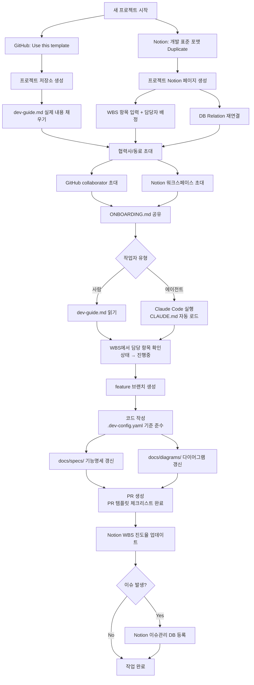

# WORKFLOW.md — 전체 워크플로우 가이드

> 이 문서는 AI Agent + GitHub + Notion 기반 개발 프레임워크의 전체 워크플로우를 정의합니다.
> 관리자(프로젝트 소유자)와 협력사/동료 두 가지 관점에서 기술합니다.

---

## 1. 파일 구조 및 역할

```
(repo root)
├── CLAUDE.md                          ← Claude Code 세션 자동 로드 (에이전트 진입점)
├── .dev-config.yaml                   ← 코딩 표준 설정값 (Config ①~⑤)
├── README.md                          ← 프로젝트 개요 + 워크플로우 다이어그램
├── docs/
│   ├── dev-guide.md                   ← 통합 개발 가이드 (에이전트 필수 참조)
│   ├── ONBOARDING.md                  ← 협력사/동료 온보딩 가이드
│   ├── WORKFLOW.md                    ← 지금 읽고 있는 파일
│   ├── diagrams/                      ← 코드 구조 다이어그램 (mermaid)
│   └── specs/                         ← 파일별 기능명세 md
└── .github/
    └── PULL_REQUEST_TEMPLATE.md       ← PR 체크리스트 템플릿
```

| 파일 | 주요 독자 | 핵심 내용 |
|---|---|---|
| `CLAUDE.md` | 에이전트 (자동 로드) | 읽기 순서 지시, 작업 체크리스트 |
| `docs/dev-guide.md` | 에이전트 + 사람 | 프로젝트 전체 개요, 기술스택, 워크플로우 상세, Notion URL |
| `.dev-config.yaml` | 에이전트 (파싱) | 코딩 표준 설정값, 자동화 트리거 규칙 |
| `docs/ONBOARDING.md` | 협력사/동료 (사람) | 환경설정, 시작 절차, FAQ |
| `docs/WORKFLOW.md` | 관리자 + 협력사 | 전체 워크플로우 정의 |
| `README.md` | 외부인 | 프로젝트 개요, Mermaid 다이어그램 |
| `.github/PULL_REQUEST_TEMPLATE.md` | PR 작성자 | PR 체크리스트 |

---

## 2. 전체 흐름 다이어그램



---

## 3. 관리자(프로젝트 소유자) 워크플로우

### 3-1. 신규 프로젝트 시작 (1회)

```
Step 1. GitHub 템플릿 복제
  └─ dev-standard-template 저장소 → "Use this template" → 새 저장소명 입력

Step 2. Notion 페이지 복제
  └─ 개발 표준 포맷 페이지 → 우클릭 → Duplicate → 프로젝트명으로 변경

Step 3. Notion 수동 작업 (복제 후 필수)
  └─ WBS ↔ 이슈관리 DB Relation 재연결
  └─ WBS ↔ 주차별 진척관리 DB Relation 재연결
  └─ 진척현황 페이지에 WBS Linked View 삽입 (/linked 명령)

Step 4. 프로젝트 내용 채우기
  └─ Notion RFP > 원본 데이터: 회의록, 요구사항 원문 입력
  └─ Notion RFP > 가공 데이터: 육하원칙 기반 요구사항 정리
  └─ Notion WBS: 개발 항목 입력, 담당자 배정, 일정 설정
  └─ GitHub docs/dev-guide.md: 프로젝트 실제 내용으로 업데이트
  └─ GitHub .dev-config.yaml: 프로젝트에 맞게 설정값 조정

Step 5. 접근 권한 부여
  └─ GitHub: Settings → Collaborators → 협력사/동료 초대
  └─ Notion: 페이지 공유 → 협력사/동료 초대
  └─ ONBOARDING.md URL 공유
```

### 3-2. 개발 세션 진행 (반복)

```
Claude Code 실행 (프로젝트 저장소 루트에서)
  └─ CLAUDE.md 자동 로드 → 컨텍스트 자동 구성

에이전트 지시 예시:
  "dev-guide.md 읽고 WBS에서 [항목명] 확인 후 작업해줘.
   완료 후 WBS 진도율 업데이트하고 PR 생성해줘."
```

### 3-3. 주차 마감 (매주)

```
- Notion 주차별 진척관리 DB: 금주 실적 + 차주 계획 작성
- WBS 전체 진도율 점검
- 이슈관리 DB 미결 이슈 확인 및 처리
```

---

## 4. 협력사 / 동료 워크플로우

### 4-1. 최초 환경 설정 (1회)

```
Step 1. 관리자에게 받아야 할 것
  - GitHub 저장소 URL
  - Notion 프로젝트 페이지 URL
  - 담당 WBS 항목명
  - Notion Integration Token (또는 워크스페이스 초대)

Step 2. 저장소 클론
  git clone {GitHub 저장소 URL}
  cd {저장소명}

Step 3. Claude Code MCP 설정
  ~/.claude/settings.json 또는 .claude/settings.json 에 아래 추가:

  {
    "mcpServers": {
      "notion": {
        "command": "npx",
        "args": ["-y", "@notionhq/notion-mcp-server"],
        "env": {
          "OPENAPI_MCP_HEADERS": "{\"Authorization\": \"Bearer {Notion Integration Token}\", \"Notion-Version\": \"2022-06-01\"}"
        }
      }
    }
  }
```

### 4-2. 작업 시작 (반복)

```
방법 A — 사람이 직접:
  1. docs/dev-guide.md 읽기
  2. Notion WBS에서 담당 항목 확인, 상태 → '진행중'
  3. git checkout -b feature/{작업항목명}
  4. 코드 작성 (.dev-config.yaml 준수)
  5. PR 생성 (develop 브랜치 대상)
  6. Notion WBS 진도율 + 상태 업데이트

방법 B — 에이전트(Claude Code):
  프로젝트 루트에서 Claude Code 실행
  → CLAUDE.md 자동 로드
  → "WBS에서 [담당 항목명] 확인하고 작업 시작해줘. 완료 후 WBS 업데이트해줘."
```

---

## 5. 환경 설정 체크리스트

### 관리자 환경 설정

| 항목 | 방법 | 빈도 |
|---|---|---|
| GitHub Template Repository 설정 | 저장소 Settings → General → Template repository 체크 | 최초 1회 |
| Claude Code MCP 설정 (Notion) | ~/.claude/settings.json 편집 | 최초 1회 |
| Notion Integration 생성 | Notion 설정 → 연결 → 새 API 통합 | 최초 1회 |
| Notion 페이지에 Integration 연결 | 페이지 우상단 ... → 연결 → Integration 선택 | 프로젝트마다 |
| GitHub 협력사 초대 | 저장소 Settings → Collaborators | 프로젝트마다 |
| Notion 협력사 초대 | 페이지 공유 → 초대 | 프로젝트마다 |

### 협력사 환경 설정

| 항목 | 방법 | 빈도 |
|---|---|---|
| Claude Code 설치 | npm install -g @anthropic/claude-code | 최초 1회 |
| Claude Code MCP 설정 (Notion) | settings.json 편집 | 최초 1회 |
| 저장소 클론 | git clone {URL} | 프로젝트마다 |

---

## 6. Notion 업데이트 규칙

| 시점 | 업데이트 항목 | Notion 위치 |
|---|---|---|
| 작업 시작 | 상태 → `진행중` | WBS DB |
| 작업 완료 | 진도율 업데이트, 상태 → `완료` | WBS DB |
| 이슈 발생 (ERROR 로그) | 이슈 등록 | 이슈관리 DB |
| PR 생성 | 관련 커밋 링크 기록 | 이슈관리 DB |
| 주차 마감 | 금주 실적 + 차주 계획 | 주차별 진척관리 DB |

---

## 7. 현재 미완성 항목 (프로젝트 시작 시 채워야 함)

아래 항목은 이 템플릿에 골격만 존재하며, 실제 프로젝트 시작 시 채워야 합니다.

| 항목 | 위치 | 작업자 |
|---|---|---|
| 프로젝트 실제 내용 | docs/dev-guide.md | 관리자 |
| 개발 항목 + 담당자 | Notion WBS DB | 관리자 |
| 요구사항 원문 | Notion RFP > 원본 데이터 | 관리자 |
| 구조화된 요구사항 | Notion RFP > 가공 데이터 | 관리자 |
| 프로젝트별 Config 조정 | .dev-config.yaml | 관리자 |
| Notion DB Relation 재연결 | Notion 진척현황, WBS | 관리자 |
| Notion WBS Linked View | Notion 진척현황 페이지 | 관리자 |
| Notion URL 기입 | docs/dev-guide.md 참고 문서 섹션 | 관리자 |
